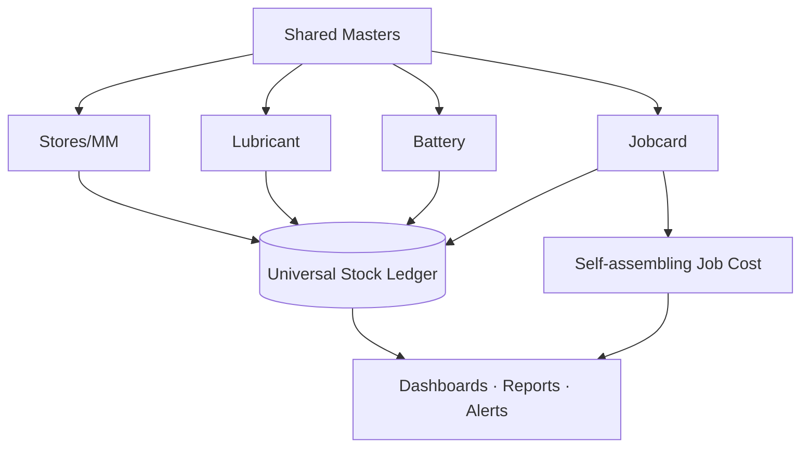

# Master Management System (MMS) — Solution Blueprint

A complete, implementation-ready blueprint for **one unified platform** that consolidates a transport
fleet + heavy-machinery workshop's separate books — **Stores/Materials, Oil & Lubricant, Battery,
Workshop Job Cards & Costing** — plus legacy Excel/backup migration, on three shared spines:

> **Shared Master Data · Universal Stock Ledger · Approval Engine** — enter once, use everywhere; every
> movement is a ledger fact; every job cost assembles itself; auditable end to end.

## What's inside

| # | Document | Contents |
|---|---|---|
| 00 | [Foundation & Standards](docs/00-foundation-and-standards.md) | Naming standards, master/txn/ledger/history/approval/costing table registry, status registry, numbering, roles, core rules — **the single source of truth** |
| 01 | [Solution Overview](docs/01-solution-overview.md) | Executive summary, value prop, module map, one-flow process map, glossary |
| 02 | [Business Architecture](docs/02-business-architecture.md) | "One transaction, many effects", domain map, module connections, traceability seams |
| 03 | [Module Breakdown](docs/03-module-breakdown.md) | Stores, Lubricant, Battery, Jobcard — submodules, transactions, approvals, reports, alerts, dashboards |
| 04 | [Database: Masters](docs/04-database-masters.md) | Master ERD + full column specs (items, assets, suppliers, locations, employees, prices, batteries) |
| 05 | [Database: Transactions & Ledger](docs/05-database-transactions.md) | The universal `l_stock_ledger`, MRN/PO/GRN/issue/transfer/job/battery tables, posting mechanics |
| 06 | [Database: Costing, History, Approvals](docs/06-database-costing-history-approval.md) | Costing tables, WAC/FIFO valuation, effective-date pricing, serial lineage, approval engine, audit |
| 07 | [Workflow Design](docs/07-workflow-design.md) | 8 end-to-end workflows with status flows + flowcharts, closure gate, override handling |
| 08 | [Costing Logic](docs/08-costing-logic.md) | Formulas, price-effective dates, pending-price rules, a fully worked job cost sheet |
| 09 | [Dashboards & KPIs](docs/09-dashboards-and-kpis.md) | Executive + operational dashboards, KPI formulas, alert logic, exception monitoring |
| 10 | [Roles & Permissions](docs/10-user-roles-and-permissions.md) | 14 roles, full CRUD/approve/reverse/close permission matrix, SoD |
| 11 | [Data Migration Strategy](docs/11-data-migration-strategy.md) | Staging & mapping tables, validation rules, reconciliation, phased plan, cutover |
| 12 | [UI/UX Design Direction](docs/12-uiux-design-direction.md) | Command-center IA, components, design tokens, key-screen wireframes, responsive/mobile |
| 13 | [Reports & Documents](docs/13-reports-and-documents.md) | Report catalogue + printable document templates |
| 14 | [Integration Architecture](docs/14-integration-architecture.md) | Excel, QR, attachments, notifications, WhatsApp/email, API, Power BI, future SAP |
| 15 | [Implementation Roadmap](docs/15-implementation-roadmap.md) | 5 phases with scope, exit criteria, dependencies, change management |
| 16 | [Risks & Controls](docs/16-risks-and-controls.md) | Risk register + internal controls + core-rule → control map |
| 17 | [Appendices A–E](docs/17-appendices.md) | Menu structure · master hierarchy · numbering · alerts · MVP vs Advanced |
| 99 | [Traceability Matrix](docs/99-traceability-matrix.md) | Requirements coverage, data-flow traceability, consistency checks, reading order |

**Consolidated references:**
- [Master Architecture & Data Model](docs/master-architecture-and-data-model.md) — business architecture,
  module map, master-data hierarchy, full cross-layer schema/table reference, status design, numbering,
  and **data governance rules** in one document.
- [Process Design — Stores, Lubricant & Battery](docs/process-design-stores-lubricant-battery.md) —
  end-to-end transaction workflows, the stock-movement posting engine, status maps, validation &
  exception handling, **screen/form-level designs**, reports and alert logic.
- [Process Design — Job Card Lifecycle & Costing](docs/process-design-jobcard-and-costing.md) —
  header/line structure, two-level approval, workshop execution, daily progress, material
  request/**reservation**, outside repair, labour capture, **cost formulas**, the closure gate, and
  open/delayed/completed monitoring.
- [Implementation & Control Layer](docs/implementation-and-control-layer.md) — migration plan &
  duplicate-detection, **site-based row-level security**, **dashboards by role** (site-scoped),
  permission matrix, report catalog, alert/notification framework, roadmap, risk register, MVP vs
  advanced.
- [Job-Card-Centric Import & Data Model](docs/jobcard-centric-import-and-data-model.md) — the job card
  as the **primary transaction object**: `job_card_*` linked tables, phased Excel import with
  parent-child linking, costing roll-up, closure controls, and traceability from every issue/labour/
  outside-repair event to total job cost.

**Interactive UI prototype:** [`prototype/index.html`](prototype/index.html) — a self-contained,
dark/light command-center dashboard realizing [Doc 12](docs/12-uiux-design-direction.md). Open it in any
browser.

## The five modules at a glance

## Design principles
Enter once, use everywhere · every movement is a ledger fact · cost follows the transaction ·
time-aware pricing · reverse-never-erase · gate the close · traceable both ways · configurable not
hard-coded.

## Start here
Read **[00 — Foundation](docs/00-foundation-and-standards.md)** first (it defines every name reused
across the set), then follow the reading order in **[99 — Traceability Matrix](docs/99-traceability-matrix.md#991-how-to-read-this-blueprint-reading-order)**.
