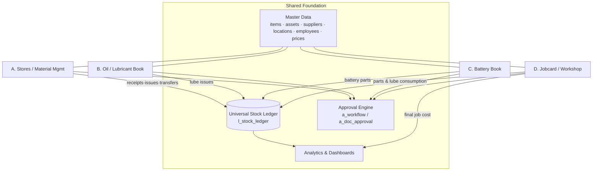

# 00 — Foundation, Master Data & Naming Standards

> **Single source of truth.** Every other document in this blueprint reuses the table names, status
> values, numbering masks and role names defined here. If something is named here, no other section
> invents a parallel name for it.

---

## 0.1 Design intent

The **Master Management System (MMS)** consolidates five previously-separate books into one platform:

1. Stores / Material Management
2. Oil / Lubricant Stock Book
3. Battery Stock Book
4. Transport Workshop Job Cards & Costing
5. Legacy Excel & backup data (imported, cleansed, migrated)

The whole system is built on **three shared spines**:

| Spine | What it is | Why it matters |
|---|---|---|
| **Shared Master Data** | One item, supplier, vehicle, location, employee record used by every module | Kills duplicate data entry; one change propagates everywhere |
| **Universal Stock Ledger** (`l_stock_ledger`) | Every receipt, issue, transfer, adjustment, return posts one immutable ledger row | Single source of stock truth, valuation, and traceability |
| **Approval Engine** (`a_*`) | Generic multi-step approval driving job cards and purchases | Auditable, configurable, consistent sign-off across modules |

---

## 0.2 Naming standards

### Table naming — prefix by role

| Prefix | Table role | Examples |
|---|---|---|
| `m_`  | Master data | `m_item`, `m_supplier`, `m_asset`, `m_battery` |
| `t_`  | Transaction header | `t_mrn`, `t_grn`, `t_job_card` |
| `t_..._line` | Transaction line / detail | `t_grn_line`, `t_job_labour` |
| `l_`  | Ledger / movement | `l_stock_ledger`, `l_stock_balance_month` |
| `h_`  | History (append-only) | `h_battery_movement`, `h_price`, `h_audit_log` |
| `a_`  | Approval / workflow | `a_workflow`, `a_doc_approval` |
| `c_`  | Costing | `c_job_cost_summary`, `c_pending_price` |
| `ref_`| Reference / lookup | `ref_status`, `ref_movement_type` |
| `stg_`| Staging (migration) | `stg_item`, `stg_opening_stock` |
| `map_`| Cross-reference / mapping (migration) | `map_item_code`, `map_supplier_code` |
| `v_`  | View | `v_item_movement`, `v_stock_on_hand` |

### Column conventions

- **All identifiers `lower_snake_case`.** No spaces, no camelCase, no reserved words.
- **Primary key:** surrogate `bigint generated always as identity`, named `<entity>_id`
  (e.g. `m_item.item_id`). Never expose the surrogate to users.
- **Business key:** human-facing `<entity>_code` (e.g. `item_code`), `UNIQUE`, indexed.
- **Foreign key columns** carry the referenced PK name verbatim: `item_id`, `supplier_id`, `location_id`.
- **Money & quantity:** `numeric(18,4)`. **Rates/factors:** `numeric(18,6)`. Never `float` for money.
- **Dates:** `date` for business dates, `timestamptz` for system timestamps.
- **Enumerations:** stored as `varchar` status codes validated against `ref_*` lookups (portable,
  reportable, and avoids fragile native enums during schema evolution).

### Standard audit columns (on every table)

```sql
created_by   bigint      not null references m_user(user_id),
created_at   timestamptz not null default now(),
updated_by   bigint          null references m_user(user_id),
updated_at   timestamptz     null,
is_active    boolean     not null default true          -- soft delete; rows are never hard-deleted
```

Approvable documents additionally carry: `approved_by`, `approved_at`, `status_code`.
**Reversal, not deletion:** posted movements are corrected by a reversing entry, never edited or deleted.

### Object naming

- Index: `ix_<table>_<cols>` · Unique: `ux_<table>_<cols>` · FK constraint: `fk_<table>_<ref>`
- Check: `ck_<table>_<rule>` · Sequence-backed doc number generator: `fn_next_docno(<doc_type>, <site>)`

---

## 0.3 Master tables (shared spine)

| Table | Purpose | Key fields |
|---|---|---|
| `m_user` | App user accounts | `user_id` PK, `username`, `employee_id` FK, `is_active` |
| `m_role` | Security roles (RBAC) | `role_id` PK, `role_code`, `name` |
| `m_permission` | Fine-grained action permissions | `permission_id` PK, `permission_code` |
| `m_approval_role` | Approval authority levels for the workflow engine | `approval_role_id` PK, `role_code`, `approval_level` |
| `m_item` | Universal item/material/lubricant/spare master | `item_id` PK, `item_code`, `item_category_id` FK, `uom_id` FK, `item_type`, `is_serialized`, `valuation_method`, `reorder_level` |
| `m_item_category` | Item classification hierarchy | `item_category_id` PK, `category_code`, `parent_category_id`, `gl_inventory_account_id` |
| `m_lubricant_detail` | Lubricant-specific attributes (1:1 with `m_item`) | `item_id` PK/FK, `grade`, `viscosity`, `base_type`, `pack_size` |
| `m_uom` | Units of measure | `uom_id` PK, `uom_code`, `decimal_precision` |
| `m_uom_conversion` | Conversions between UoMs | `uom_conversion_id` PK, `from_uom_id`, `to_uom_id`, `factor` |
| `m_supplier` | Suppliers, vendors & subcontractors | `supplier_id` PK, `supplier_code`, `supplier_type`, `payment_terms` |
| `m_brand` | Brands (batteries, lubricants, parts) | `brand_id` PK, `brand_code`, `name` |
| `m_asset` | Maintainable-object master (superset) | `asset_id` PK, `asset_code`, `asset_type`, `site_id` FK, `department_id` FK, `status` |
| `m_vehicle` | Vehicle attributes (1:1 subtype of `m_asset`) | `asset_id` PK/FK, `reg_no`, `make`, `model`, `chassis_no`, `odometer` |
| `m_machine` | Machine attributes (1:1 subtype of `m_asset`) | `asset_id` PK/FK, `capacity`, `hours_meter` |
| `m_workshop_asset` | Workshop equipment/tools/bays (subtype of `m_asset`) | `asset_id` PK/FK, `equip_type`, `bay_no` |
| `m_battery` | Serialized battery instances (one row = one physical battery) | `battery_id` PK, `serial_no` UQ, `item_id` FK, `brand_id`, `original_asset_id`, `current_asset_id`, `warranty_months`, `image_url` |
| `m_employee` | Employees & technicians | `employee_id` PK, `employee_code`, `is_technician`, `department_id` FK |
| `m_technician_rate` | Effective-dated labour rates | `rate_id` PK, `employee_id` FK, `hourly_rate`, `effective_from`, `effective_to` |
| `m_site` | Top of location hierarchy | `site_id` PK, `site_code`, `region` |
| `m_location` | Stores/warehouses/bins (hierarchical) | `location_id` PK, `location_code`, `site_id` FK, `location_type`, `parent_location_id` |
| `m_department` | Departments / cost centers | `department_id` PK, `dept_code`, `cost_center_code`, `site_id` FK |
| `m_project` | Projects (for lubricant/cost attribution) | `project_id` PK, `project_code`, `site_id` FK, `status` |
| `m_price` | Effective-dated price master | `price_id` PK, `item_id` FK, `price_type`, `supplier_id`, `unit_price`, `effective_from`, `effective_to` |
| `m_gl_account` | GL/account mapping | `gl_account_id` PK, `account_code`, `account_type` |

> **Vehicle & Machine are modelled as subtypes of `m_asset`.** This lets "job cost by vehicle",
> "lubricant by machine", and "battery by asset" all share one maintainable-object key (`asset_id`),
> while keeping type-specific attributes in their own subtype tables. No duplicate asset lists.

---

## 0.4 Transaction tables

| Table | Purpose | Key fields |
|---|---|---|
| `t_mrn` / `t_mrn_line` | Material Requisition Note (demand from site/dept) | `mrn_id` PK, `mrn_no`, `site_id`, `department_id`, `status_code` |
| `t_purchase_order` / `t_po_line` | Local (LPO) & Head-Office (HPR) purchasing | `po_id` PK, `po_no`, `po_type`, `supplier_id`, `status_code` |
| `t_grn` / `t_grn_line` | Goods Receipt Note + pricing & valuation | `grn_id` PK, `grn_no`, `po_id`, `price_received_date`, `is_priced`, `status_code` |
| `t_issue` / `t_issue_line` | General, job & lubricant issues | `issue_id` PK, `issue_no`, `issue_type`, `job_card_id`, `asset_id`, `project_id`, `status_code` |
| `t_transfer` / `t_transfer_line` | Inter-location material transfer | `transfer_id` PK, `transfer_no`, `from_location_id`, `to_location_id`, `status_code` |
| `t_stock_adjustment` / `t_stock_adjustment_line` | Physical count / correction adjustments | `adjustment_id` PK, `adj_no`, `reason_code`, `status_code` |
| `t_battery_txn` | Battery punch / issue / transfer / return / replace / scrap / warranty / repair | `battery_txn_id` PK, `txn_no`, `txn_type`, `battery_id`, `from_asset_id`, `to_asset_id`, `status_code` |
| `t_job_card` | Workshop job card (header) | `job_card_id` PK, `jc_no`, `asset_id`, `status_code`, planned/actual dates, approvals |
| `t_job_task` | Job card task breakdown | `task_id` PK, `job_card_id` FK, `status` |
| `t_job_progress` | Daily work-done log | `progress_id` PK, `job_card_id` FK, `log_date`, `work_done` |
| `t_job_parts_request` | Internal/external parts requests against a job | `request_id` PK, `job_card_id` FK, `item_id`, `request_type`, `source`, `status_code` |
| `t_job_labour` | Technician labour entries | `labour_id` PK, `job_card_id` FK, `employee_id`, `work_date`, `hours`, `hourly_rate` |
| `t_outside_repair` | Outside/subcontract repair | `outside_repair_id` PK, `or_no`, `job_card_id`, `supplier_id`, `status_code` |

---

## 0.5 Movement tables

| Table | Purpose | Key fields |
|---|---|---|
| `l_stock_ledger` | **The heart.** One immutable row per stock movement | `ledger_id` PK, `item_id`, `location_id`, `movement_type`, `qty_in`, `qty_out`, `unit_cost`, `movement_value`, `running_balance_qty`, `running_balance_value`, `source_doc_type`, `source_doc_id`, `txn_date` |
| `l_stock_balance_month` | Frozen monthly opening/closing snapshot per item×location | `balance_id` PK, `item_id`, `location_id`, `period_year`, `period_month`, `opening_qty`, `closing_qty`, `closing_value`, `avg_unit_cost` |

---

## 0.6 History tables

| Table | Purpose | Key fields |
|---|---|---|
| `h_battery_movement` | Full serial-level movement lineage of every battery | `history_id` PK, `battery_id`, `battery_txn_id`, `event_type`, `from_asset_id`, `to_asset_id`, `event_date` |
| `h_battery_lifecycle` | Lifecycle/status events (warranty, scrap, repair) | `lifecycle_id` PK, `battery_id`, `event_type`, `status_from`, `status_to`, `warranty_flag` |
| `h_price` | Append-only price change history | `price_history_id` PK, `item_id`, `unit_price`, `effective_from`, `source_doc_type` |
| `h_audit_log` | Universal change log (who changed what) | `audit_id` PK, `table_name`, `record_id`, `action`, `changed_by`, `old_values` jsonb, `new_values` jsonb |

---

## 0.7 Approval tables

| Table | Purpose | Key fields |
|---|---|---|
| `a_workflow` | Definition of an approval flow per doc type | `workflow_id` PK, `workflow_code`, `doc_type`, `is_active` |
| `a_workflow_step` | Ordered steps and required approval role | `step_id` PK, `workflow_id`, `step_no`, `approval_role_id`, `sla_hours` |
| `a_doc_approval` | Live approval state of one document | `doc_approval_id` PK, `workflow_id`, `doc_type`, `doc_id`, `current_step_no`, `status` |
| `a_approval_action` | Each approve / reject / return action taken | `action_id` PK, `doc_approval_id`, `step_no`, `action`, `acted_by`, `acted_at`, `comments` |

---

## 0.8 Costing tables

| Table | Purpose | Key fields |
|---|---|---|
| `c_job_cost_summary` | Rolled-up cost per job card | `cost_summary_id` PK, `job_card_id` UQ, `labour_cost`, `material_cost`, `general_cost`, `outside_cost`, `total_cost`, `estimated_cost`, `variance_amount`, `variance_pct`, `is_final` |
| `c_job_cost_detail` | Cost lines by element with price provenance | `cost_detail_id` PK, `job_card_id`, `cost_element`, `source_doc_type`, `source_doc_id`, `qty`, `unit_cost`, `line_cost`, `effective_price_date`, `is_provisional` |
| `c_pending_price` | Queue of unpriced receipts/issues blocking closure | `pending_price_id` PK, `source_doc_type`, `source_doc_id`, `item_id`, `qty`, `resolved_flag` |
| `c_fifo_layer` | Optional FIFO cost layers per item×location | `layer_id` PK, `item_id`, `location_id`, `grn_id`, `remaining_qty`, `unit_cost`, `received_date` |

---

## 0.9 Status registry (canonical status flows)

All statuses are `UPPER_SNAKE`. These exact values are reused in every workflow, chip and report.

| Process (`ref_status.doc_type`) | Ordered status flow |
|---|---|
| **MRN** | `DRAFT → SUBMITTED → APPROVED → PARTIALLY_ISSUED → ISSUED → CLOSED` (· `CANCELLED`) |
| **Purchase (LPO / HPR)** | `DRAFT → SUBMITTED → APPROVED → ORDERED → PARTIALLY_RECEIVED → RECEIVED → CLOSED` (· `CANCELLED`) |
| **GRN** | `DRAFT → RECEIVED → PENDING_PRICING → PRICED → POSTED` (· `CANCELLED`) |
| **Material Transfer** | `DRAFT → SUBMITTED → IN_TRANSIT → RECEIVED → POSTED` (· `CANCELLED`) |
| **Issue (General / Job / Lubricant)** | `DRAFT → ISSUED → POSTED` (· `OVERRIDE_ISSUED` · `CANCELLED`) |
| **Stock Adjustment** | `DRAFT → SUBMITTED → APPROVED → POSTED` (· `REJECTED` · `CANCELLED`) |
| **Battery Txn** | `DRAFT → CONFIRMED → POSTED` (· `CANCELLED`) |
| **Job Card** | `DRAFT → SUBMITTED → TM_APPROVED → OM_APPROVED → ROUTED_TO_WORKSHOP → IN_PROGRESS → WORK_COMPLETED → PENDING_COSTING → COSTED → CLOSED` (· `ON_HOLD` · `DELAYED` · `CANCELLED`) |
| **Outside Repair** | `REQUESTED → APPROVED → SENT → IN_PROGRESS → RECEIVED → INVOICED → COSTED → CLOSED` (· `CANCELLED`) |
| **Parts Request** | `REQUESTED → APPROVED → SOURCING → ISSUED`/`PURCHASED → RECEIVED → CLOSED` (· `REJECTED`) |
| **Approval (generic)** | `PENDING → APPROVED` (· `REJECTED` · `RETURNED`) |

> `DELAYED` and `ON_HOLD` are **flags layered on the Job Card flow**, not replacements for it — a job
> can be `IN_PROGRESS` *and* `DELAYED`. This is stored as `t_job_card.status_code` plus a derived
> `is_delayed` flag (planned_start/end breached).

---

## 0.10 Transaction numbering formats

Masks: `{SITE}` = site code · `{YY}` = 2-digit year · `{NNNNN}` = zero-padded running number,
**reset yearly per doc-type per site**. Generated centrally by `fn_next_docno()` (gap-free, concurrency-safe).

| Doc type | Mask | Example |
|---|---|---|
| MRN | `MRN-{SITE}-{YY}-{NNNNN}` | `MRN-HO-26-00042` |
| Local Purchase Order | `LPO-{SITE}-{YY}-{NNNNN}` | `LPO-CS-26-00301` |
| Head-Office Purchase Requisition | `HPR-{YY}-{NNNNN}` | `HPR-26-00088` |
| Goods Receipt Note | `GRN-{SITE}-{YY}-{NNNNN}` | `GRN-CS-26-01187` |
| Material Transfer | `TRF-{FROM}-{YY}-{NNNNN}` | `TRF-CS-26-00210` |
| General Issue | `ISS-{SITE}-{YY}-{NNNNN}` | `ISS-WS-26-00733` |
| Lubricant Issue | `LUB-{SITE}-{YY}-{NNNNN}` | `LUB-WS-26-00925` |
| Battery Transaction | `BAT-{YY}-{NNNNN}` | `BAT-26-00377` |
| Job Card | `JC-{SITE}-{YY}-{NNNNN}` | `JC-WS-26-00514` |
| Outside Repair | `OR-{YY}-{NNNNN}` | `OR-26-00061` |
| Parts Request | `PR-{JCSEQ}-{NN}` | `PR-JCWS2600514-02` |
| Stock Adjustment | `ADJ-{SITE}-{YY}-{NNNNN}` | `ADJ-CS-26-00045` |

---

## 0.11 Module map



| Module | Submodules |
|---|---|
| **A. Stores / Material Management** | MRN · Local Purchase · Head-Office Purchase · GRN/Receiving · Pricing · General Items & Issues · Transfers · Stock Balance · Movement History · Pending-Price Tracking |
| **B. Oil / Lubricant Stock Book** | Lubricant Master · Lube Ledger · Site Issues · Asset-wise Consumption · Monthly Balance · Forecast/Reorder · Price History · Consumption Mapping · Lube Dashboard |
| **C. Battery Stock Book** | Battery Master · Serial Tracking · Photo Record · Assignment (original/current) · Transfer History · Punch/Issue · Return/Replace/Scrap/Warranty/Repair · Lifecycle Dashboard |
| **D. Jobcard / Workshop** | Job Card · Approvals · Workshop Routing · Progress Log · Parts Requests · Labour · Outside Repair · Costing · Closure · Job Dashboards |
| **Shared** | Masters · Universal Stock Ledger · Approval Engine · Analytics · Admin & Security · Migration |

---

## 0.12 Role list

| Role (`role_code`) | Summary |
|---|---|
| `store_keeper` | Raises MRNs, issues & transfers stock, keeps bin accuracy |
| `receiving_clerk` | Records GRNs / receipts against POs and MRNs |
| `pricing_officer` | Enters/updates prices, clears the pending-price queue, sets effective dates |
| `inventory_controller` | Owns valuation, adjustments, cycle counts, reorder policy |
| `lubricant_officer` | Manages lubricant issues, consumption mapping, monthly balance |
| `battery_custodian` | Manages battery serials, punches, transfers, warranty claims |
| `transport_officer` | Creates job cards from the transport section |
| `transport_manager` | Level-1 job card approval (`TM_APPROVED`) |
| `operational_manager` | Level-2 job card approval (`OM_APPROVED`) |
| `workshop_supervisor` | Routes/schedules jobs, records progress, manages technicians & outside repair |
| `technician` | Executes work, logs labour hours and daily work-done |
| `finance_reviewer` | Reviews costing, variance, supplier spend; final financial sign-off |
| `management_viewer` | Read-only executive dashboards and reports |
| `system_administrator` | Users, roles, workflows, masters, migration, configuration |

---

## 0.13 Core business rules (enforced everywhere)

| # | Rule | Enforced by |
|---|---|---|
| 1 | Every issue/receipt/transfer/adjustment/return posts a `l_stock_ledger` row | DB trigger + service layer |
| 2 | No issue if stock insufficient, unless an authorized override is recorded | `OVERRIDE_ISSUED` status + approval |
| 3 | Job cards cannot close until materials received, priced, labour captured, outside costs entered, approvals complete | Closure gate (`fn_can_close_job`) |
| 4 | Battery movements preserve full serial history | `h_battery_movement` append-only |
| 5 | Lubricant consumption traceable by vehicle/machine/site/date | `t_issue.asset_id/site_id/project_id` |
| 6 | Prices use effective-date logic | `m_price` / `h_price` effective ranges |
| 7 | Transfers reduce source & increase destination | Paired ledger rows (TRANSFER_OUT/IN) |
| 8 | Every transaction carries full audit fields | Standard audit columns + `h_audit_log` |
| 9 | Migration validates duplicates, keys, dates, quantities before posting | `stg_*` + validation rules |
| 10 | Supports both operational users and management reporting | RBAC + dashboards + read replica |
