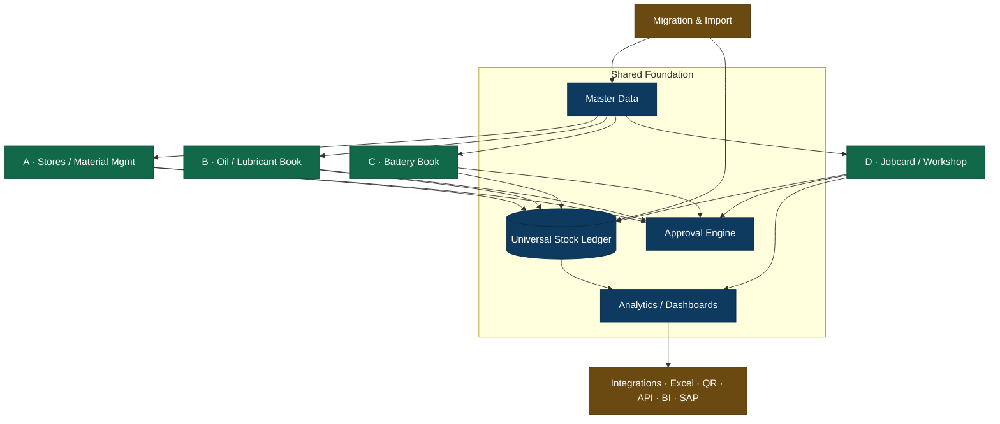

# 01 — Solution Overview

## 1.1 Executive summary

Today the operation runs on **five disconnected books** — a stores system, an oil/lubricant stock
book, a battery stock book, workshop job cards, and a pile of Excel files and old-system backups.
Each holds its own copy of "the item", "the vehicle", "the supplier". Numbers are re-keyed between
them, stock never quite reconciles, a job card's true cost is assembled by hand at month-end, and no
one can answer "what did we spend maintaining vehicle CAB-1123 last quarter?" without opening four
files.

The **Master Management System (MMS)** replaces those five books with **one platform on three shared
spines** — shared master data, a universal stock ledger, and a configurable approval engine — so that
a single action taken by a clerk automatically and correctly updates stock, valuation, job costing,
history and dashboards, with a full audit trail, and never needs to be re-typed anywhere.

**Value proposition (one line):** *One record of the item, the asset and the price; one ledger for
every movement; one job cost that assembles itself as work happens — auditable end to end.*

## 1.2 Problems this system removes

| Today's pain | MMS resolution |
|---|---|
| Same item/supplier/vehicle typed into 4 systems | One shared master; entered once, used everywhere |
| Stock balances differ between book and shelf | Every movement posts to `l_stock_ledger`; running balance is the book |
| Job cost calculated manually at month-end | `c_job_cost_*` accrue automatically as parts/labour/outside costs post |
| "What price applied that day?" is guesswork | Effective-dated `m_price` / `h_price` resolves cost as of transaction date |
| Battery history lost when it moves vehicles | `h_battery_movement` keeps unbroken serial lineage |
| Lubricant burn per vehicle unknown | Every lube issue tags `asset_id` + `site_id` + `project_id` |
| Approvals happen on paper / WhatsApp | `a_workflow` records who approved what, when |
| Excel is the "database" | Excel becomes a validated *import channel*, not the system of record |

## 1.3 High-level module map

## 1.4 Process map — one breakdown, followed all the way through

This single scenario shows how *one* operational event ripples through *every* spine. Vehicle
**CAB-1123** breaks down on site.

| # | Action | Module | System effects (automatic) |
|---|---|---|---|
| 1 | Transport officer raises job card `JC-WS-26-00514` | Jobcard | Status `DRAFT→SUBMITTED`; approval doc opened |
| 2 | Transport manager then operational manager approve | Approval | `TM_APPROVED → OM_APPROVED`; `a_approval_action` rows written |
| 3 | Workshop supervisor routes & starts the job | Jobcard | `ROUTED_TO_WORKSHOP → IN_PROGRESS`; `actual_start` set |
| 4 | Supervisor requests 1 alternator + 4 bolts | Parts Request | `t_job_parts_request` rows; checked against stock |
| 5 | Store keeper issues the parts to the job | Stores | `t_issue (JOB)` → **2 `l_stock_ledger` ISSUE rows**; `c_job_cost_detail` MATERIAL lines at effective cost |
| 6 | Technician tops up 6 L engine oil against the job | Lubricant | `t_issue (LUBRICANT)` tagged `asset_id=CAB-1123` → ledger ISSUE + MATERIAL cost + consumption history |
| 7 | Old battery swapped; new one punched | Battery | `t_battery_txn (REPLACEMENT)` → `h_battery_movement`; old serial history preserved |
| 8 | Injector pump sent for subcontract overhaul | Outside Repair | `t_outside_repair`; on return a GRN prices it → `c_job_cost_detail` OUTSIDE line |
| 9 | Two technicians log 6.5 labour hours | Labour | `t_job_labour` × effective `hourly_rate` → `c_job_cost_detail` LABOUR lines |
| 10 | Supervisor completes; costing gate runs | Costing | `WORK_COMPLETED → PENDING_COSTING`; gate checks all priced |
| 11 | Finance reviews cost vs estimate | Costing | `c_job_cost_summary` total, `variance_amount/pct` |
| 12 | Job closed | Jobcard | `COSTED → CLOSED`; ledger, costing, history all consistent |

**Nothing in steps 5–12 was re-typed.** The alternator's cost came from its GRN price; the labour rate
from the technician's effective rate; the job total assembled itself. That is the entire point of the
system.

## 1.5 Guiding design principles

1. **Enter once, use everywhere** — masters are shared; no module keeps its own copy of an entity.
2. **Every movement is a ledger fact** — the ledger, not a form field, is the source of stock truth.
3. **Cost follows the transaction** — costing lines are byproducts of real postings, never manual.
4. **Time-aware pricing** — cost is always resolved *as of* the transaction date.
5. **Reverse, never erase** — corrections are reversing entries; history is immutable.
6. **Gate the close** — a job cannot close until it is complete, priced and approved.
7. **Traceable both ways** — from a KPI tile you can drill to the exact source document, and from a
   source document you can see every downstream effect.
8. **Configurable, not hard-coded** — approval steps, reorder levels, numbering and thresholds are data.

## 1.6 Glossary

| Term | Meaning |
|---|---|
| **MRN** | Material Requisition Note — a demand for materials from a site/department |
| **LPO** | Local Purchase Order — purchase from a local supplier |
| **HPR** | Head-Office Purchase Requisition — procurement routed through head office |
| **GRN** | Goods Receipt Note — records physical receipt and drives valuation |
| **Stock Ledger** | `l_stock_ledger`, the immutable movement log and single stock truth |
| **Movement type** | RECEIPT / ISSUE / TRANSFER_IN / TRANSFER_OUT / ADJUSTMENT / RETURN / OPENING |
| **Effective price** | The price valid on a given date, from `m_price`/`h_price` |
| **WAC** | Weighted Average Cost — default valuation method |
| **Punch** | Assigning/issuing a battery to a vehicle |
| **Job Card (JC)** | Workshop work order carrying labour, material, general & outside costs |
| **Closure gate** | The rule set (`fn_can_close_job`) that blocks premature job closing |
| **Pending price** | A received/issued item awaiting a price before costing can finalize |
