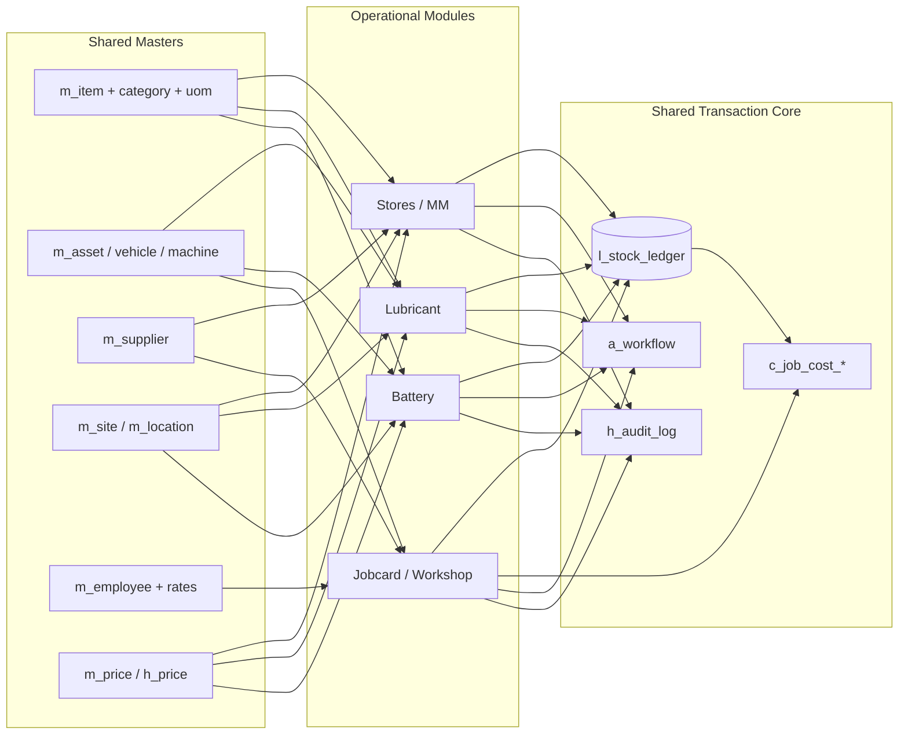

# 02 — Business Architecture

## 2.1 The target system, in business language

The MMS is a **single operational backbone** for stores, lubricants, batteries and the workshop.
Instead of four departments each keeping their own list of items, vehicles and suppliers, everyone
draws from **one shared master library**. Instead of each book tracking its own stock, every physical
movement of any item is written once to **one universal ledger**. And instead of costing a repair by
hand, the workshop's job card **collects its own costs** as parts are issued, technicians log hours,
and outside repairs come back priced.

Three ideas make this work:

1. **Shared masters** — one row for CAB-1123, one row for "Engine Oil 15W-40", one row for supplier
   "Lanka Lubricants". Every module points at these same rows. Change a supplier's payment terms once;
   it is correct in stores, purchasing and costing simultaneously.

2. **The universal stock ledger** — the single table `l_stock_ledger` records *every* receipt, issue,
   transfer, adjustment and return, for *every* item type (spares, general items, lubricants, battery
   stock), across *every* location. Stock-on-hand is not a field someone edits; it is the running
   balance of this ledger. This is what makes stock trustworthy.

3. **One transaction, many effects** — a single business action fans out into stock, valuation,
   costing, history and reporting *automatically and atomically*. The operator does one thing; the
   system does the rest, consistently.

## 2.2 Domain / context map

## 2.3 The "one transaction, many effects" principle — worked examples

### Example A — Issue a spare part to a job card

| Effect | Table touched | What happens |
|---|---|---|
| Stock reduced | `l_stock_ledger` | One `ISSUE` row: `qty_out`, new `running_balance_qty/value` |
| Valuation | ledger `unit_cost` | Cost drawn from WAC/effective price at issue date |
| Job costing | `c_job_cost_detail` | A `MATERIAL` cost line linked to `source_doc = t_issue` |
| Job total | `c_job_cost_summary` | `material_cost` and `total_cost` recomputed |
| Movement history | `v_item_movement` | Item now shows this issue in its movement trail |
| Audit | `h_audit_log` | Who issued, when, from which location |
| Dashboards | analytics | "Job cost by vehicle", "fast-moving items", "stock value" all shift |

### Example B — Transfer 200 L lubricant from Central Store to Workshop

| Effect | Table touched | What happens |
|---|---|---|
| Source reduced | `l_stock_ledger` | `TRANSFER_OUT` row at Central Store (`qty_out = 200`) |
| Destination increased | `l_stock_ledger` | Paired `TRANSFER_IN` row at Workshop (`qty_in = 200`) |
| Value moves, not created | both rows | Same `unit_cost`; total inventory value unchanged |
| Dashboards | analytics | "Transfer volume by location" increments |

*(Core rule 7: a transfer is always two ledger rows — nothing is lost between them.)*

### Example C — GRN receives a part with no price yet

| Effect | Table touched | What happens |
|---|---|---|
| Stock increased | `l_stock_ledger` | `RECEIPT` row; if unpriced, `unit_cost` provisional |
| Pending price | `c_pending_price` | A row is queued; item flagged for pricing officer |
| Costing blocked | job closure | Any job consuming this item cannot finalize until priced |
| Dashboard | "pending pricing" | KPI increments; alert to pricing officer |

### Example D — Punch a new battery into a vehicle

| Effect | Table touched | What happens |
|---|---|---|
| Battery assigned | `m_battery` | `current_asset_id` set; `original_asset_id` if first |
| Serial history | `h_battery_movement` | Immutable `PUNCH` event with date & odometer |
| Stock reduced | `l_stock_ledger` | Battery stock item `ISSUE` row |
| Lifecycle | `h_battery_lifecycle` | Status → `IN_SERVICE`; warranty clock starts |

## 2.4 How the four modules connect

| From module | To module | Connection point | Business meaning |
|---|---|---|---|
| Jobcard | Stores | `t_job_parts_request` → `t_issue (JOB)` | Parts a job needs are issued from and costed against stores |
| Jobcard | Lubricant | `t_issue (LUBRICANT, asset_id)` | Lube consumed in a repair is costed to the job *and* the asset |
| Jobcard | Battery | `t_battery_txn (job_card_id)` | Battery swaps done under a job are linked to that job |
| Jobcard | Outside repair | `t_outside_repair → t_grn` | Subcontract cost enters via a GRN, then the job |
| Stores | All | `l_stock_ledger` | Every module's material movement is one ledger |
| Any | Approval | `a_doc_approval` | Purchases and job cards flow through one engine |
| All | Analytics | shared ledger + costing | Every KPI derives from the same source tables |

## 2.5 Preventing duplicate data

- **Single master per entity.** Lubricants and batteries are *not* separate item lists — they are
  `m_item` rows in the `LUBRICANT`/`BATTERY_STOCK` categories, extended by `m_lubricant_detail` and
  serialized via `m_battery`. This means one part number, one valuation, one movement history.
- **Vehicles and machines share `m_asset`.** "Job cost by vehicle" and "lubricant by machine" resolve
  against the same `asset_id`, so an asset is never double-listed.
- **Reference/lookup tables** (`ref_status`, `ref_movement_type`, `ref_uom`) centralize enumerations so
  no module hard-codes its own list of statuses or movement types.

## 2.6 Auditability & traceability seams

Every posted document exposes a **two-way trace**:

- **Forward (document → effects):** `source_doc_type` + `source_doc_id` on every ledger and costing
  row let you open a GRN and see every stock and cost effect it produced.
- **Backward (KPI → document):** dashboard tiles drill through `l_stock_ledger` / `c_job_cost_detail`
  back to the exact MRN, GRN, issue, transfer or job card that caused the number.
- **Change trail:** `h_audit_log` captures old/new values for every insert/update/approve/reverse,
  satisfying core rule 8 (full audit fields) beyond just created/updated stamps.

This closed loop — shared masters in, one ledger through, two-way trace out — is the architecture.
Every later section (database, workflow, costing, dashboards) is an elaboration of these seams.
