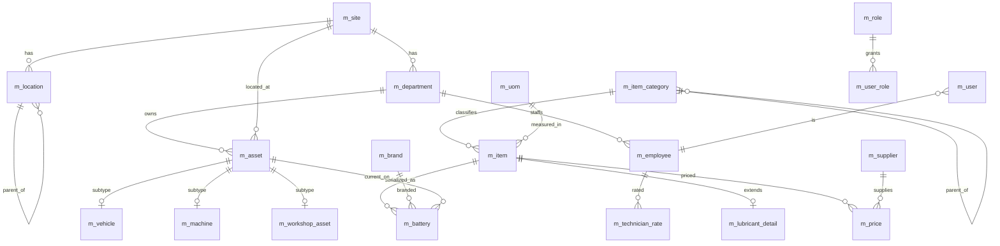

# 04 — Database Design: Master Tables

PostgreSQL-class relational model. Conventions from [00 — Foundation §0.2](00-foundation-and-standards.md).

## 4.1 Conventions applied

- Surrogate PK `bigint generated always as identity`, named `<entity>_id`.
- Human business key `<entity>_code varchar` — `UNIQUE`, indexed, user-facing.
- Money/qty `numeric(18,4)`; factors/rates `numeric(18,6)`; percentages `numeric(9,4)`.
- Every table carries the **standard audit columns** (`created_by, created_at, updated_by, updated_at,
  is_active`) — omitted from the column tables below for brevity, assume present.
- **Soft delete** via `is_active=false`; rows are never hard-deleted (referential & audit integrity).
- **Effective-dating** pattern (`effective_from`, `effective_to null = open`) for prices and rates.

## 4.2 Master-layer ERD

## 4.3 Classification & UoM

### `m_item_category`
| Column | Type | Key | Notes |
|---|---|---|---|
| item_category_id | bigint | PK | |
| category_code | varchar(20) | UQ | e.g. `SPARE`, `LUBRICANT`, `BATTERY_STOCK`, `GENERAL`, `TYRE` |
| name | varchar(100) | | |
| parent_category_id | bigint | FK→self | hierarchy |
| valuation_default | varchar(10) | | `WAC` / `FIFO` |
| gl_inventory_account_id | bigint | FK→m_gl_account | |

### `m_uom` / `m_uom_conversion`
| Column | Type | Key | Notes |
|---|---|---|---|
| uom_id | bigint | PK | |
| uom_code | varchar(10) | UQ | `EA`, `L`, `KG`, `SET`, `BOX` |
| name | varchar(50) | | |
| decimal_precision | smallint | | issue rounding |

| Column | Type | Key | Notes |
|---|---|---|---|
| uom_conversion_id | bigint | PK | |
| from_uom_id | bigint | FK→m_uom | e.g. BOX |
| to_uom_id | bigint | FK→m_uom | e.g. EA |
| factor | numeric(18,6) | | 1 BOX = 24 EA → 24 |

> **UoM conversion** lets purchase (BOX/DRUM) and issue (EA/L) use different units while the ledger
> stores a single **stock UoM** per item; conversions apply at receipt/issue.

## 4.4 Item master (universal)

### `m_item`
| Column | Type | Key | Notes |
|---|---|---|---|
| item_id | bigint | PK | |
| item_code | varchar(30) | UQ | company part number |
| description | varchar(200) | | |
| item_category_id | bigint | FK | drives valuation & GL |
| stock_uom_id | bigint | FK→m_uom | canonical stock unit |
| item_type | varchar(20) | | `STOCK` / `GENERAL` / `LUBRICANT` / `BATTERY_STOCK` / `SERVICE` |
| is_serialized | boolean | | true for batteries |
| valuation_method | varchar(10) | | `WAC` (default) / `FIFO` |
| reorder_level | numeric(18,4) | | triggers reorder alert |
| min_qty / max_qty | numeric(18,4) | | stocking policy |
| lead_time_days | smallint | | forecasting |
| default_location_id | bigint | FK→m_location | default bin |
| gl_inventory_account_id | bigint | FK | overrides category if set |
| barcode | varchar(50) | | QR/barcode value |
| is_active | boolean | | |

### `m_lubricant_detail` (1:1 extension of `m_item`)
| Column | Type | Key | Notes |
|---|---|---|---|
| item_id | bigint | PK/FK | shares item identity |
| grade | varchar(30) | | `15W-40` |
| viscosity | varchar(20) | | |
| base_type | varchar(20) | | mineral / semi-syn / synthetic |
| pack_size | numeric(18,4) | | drum/pack litres |
| api_spec | varchar(30) | | e.g. `CI-4` |

## 4.5 Assets (vehicles, machines, workshop equipment)

### `m_asset` (superset / maintainable object)
| Column | Type | Key | Notes |
|---|---|---|---|
| asset_id | bigint | PK | |
| asset_code | varchar(30) | UQ | fleet number |
| name | varchar(120) | | |
| asset_type | varchar(20) | | `VEHICLE` / `MACHINE` / `WORKSHOP_EQUIP` |
| site_id | bigint | FK→m_site | |
| department_id | bigint | FK→m_department | cost attribution |
| status | varchar(20) | | `ACTIVE`/`IDLE`/`DISPOSED` |
| commissioned_date | date | | |

### `m_vehicle` / `m_machine` / `m_workshop_asset` (1:1 subtypes)
| `m_vehicle` | Type | Notes |
|---|---|---|
| asset_id | bigint PK/FK | |
| reg_no | varchar(20) UQ | number plate |
| make / model / year | varchar / smallint | |
| chassis_no / engine_no | varchar(40) | |
| fuel_type | varchar(15) | |
| odometer | numeric(18,2) | latest reading |

| `m_machine` | Type | Notes |
|---|---|---|
| asset_id | bigint PK/FK | |
| capacity | varchar(40) | |
| hours_meter | numeric(18,2) | machine-hours |

| `m_workshop_asset` | Type | Notes |
|---|---|---|
| asset_id | bigint PK/FK | |
| equip_type | varchar(40) | lift/press/diagnostic |
| bay_no | varchar(10) | |

## 4.6 Serialized batteries

### `m_battery`
| Column | Type | Key | Notes |
|---|---|---|---|
| battery_id | bigint | PK | |
| serial_no | varchar(50) | UQ | physical serial |
| item_id | bigint | FK→m_item | the battery stock item |
| brand_id | bigint | FK→m_brand | |
| battery_type | varchar(30) | | lead-acid/AGM/… |
| size | varchar(20) | | e.g. `N150` |
| voltage | numeric(6,2) | | |
| ah_capacity | numeric(8,2) | | |
| warranty_months | smallint | | |
| supplier_id | bigint | FK→m_supplier | |
| purchase_price | numeric(18,4) | | |
| grn_id | bigint | FK→t_grn | receipt link |
| grn_date | date | | |
| manufacture_date | date | | warranty base |
| original_asset_id | bigint | FK→m_asset | first vehicle |
| current_asset_id | bigint | FK→m_asset | present vehicle (null = spare) |
| current_status | varchar(20) | | `IN_STOCK`/`IN_SERVICE`/`RETURNED`/`SCRAPPED`/`WARRANTY_CLAIM`/`REPAIR` |
| image_url | varchar(300) | | serial-plate photo |
| warranty_expiry | date | | derived = manufacture_date + warranty_months |

## 4.7 People & rates

### `m_employee`
| Column | Type | Key | Notes |
|---|---|---|---|
| employee_id | bigint | PK | |
| employee_code | varchar(20) | UQ | |
| full_name | varchar(120) | | |
| designation | varchar(60) | | |
| department_id | bigint | FK | |
| site_id | bigint | FK | |
| is_technician | boolean | | eligible for labour entries |
| default_hourly_rate | numeric(18,4) | | fallback rate |

### `m_technician_rate` (effective-dated)
| Column | Type | Key | Notes |
|---|---|---|---|
| rate_id | bigint | PK | |
| employee_id | bigint | FK | |
| hourly_rate | numeric(18,4) | | |
| effective_from | date | | |
| effective_to | date | | null = current |

> Labour cost resolves the rate where `work_date BETWEEN effective_from AND coalesce(effective_to,'9999-12-31')`.

## 4.8 Suppliers, brands, GL

### `m_supplier`
| Column | Type | Key | Notes |
|---|---|---|---|
| supplier_id | bigint | PK | |
| supplier_code | varchar(20) | UQ | |
| name | varchar(150) | | |
| supplier_type | varchar(20) | | `LOCAL`/`HEAD_OFFICE`/`SUBCONTRACTOR` |
| tax_id | varchar(30) | | |
| contact_person / phone / email | varchar | | |
| address | varchar(250) | | |
| payment_terms | varchar(40) | | |
| gl_payable_account_id | bigint | FK→m_gl_account | |

`m_brand` — `brand_id` PK, `brand_code` UQ, `name`.
`m_gl_account` — `gl_account_id` PK, `account_code` UQ, `name`, `account_type` (`INVENTORY`/`EXPENSE`/`PAYABLE`/`WIP`).

## 4.9 Location hierarchy

### `m_site` → `m_location` (self-referencing) → bins
| `m_site` | Type | Notes |
|---|---|---|
| site_id | bigint PK | |
| site_code | varchar(15) UQ | used in doc numbers (`{SITE}`) |
| name | varchar(120) | |
| region | varchar(60) | |

| `m_location` | Type | Notes |
|---|---|---|
| location_id | bigint PK | |
| location_code | varchar(20) UQ | |
| name | varchar(120) | |
| site_id | bigint FK→m_site | |
| location_type | varchar(20) | `STORE`/`SITE_STORE`/`WORKSHOP`/`BIN`/`IN_TRANSIT` |
| parent_location_id | bigint FK→self | store→bin nesting |

> **Hierarchy:** `Site → Location(STORE/WORKSHOP) → Location(BIN)`. Stock is held at the *lowest*
> location level and rolls up for balance reporting. A virtual `IN_TRANSIT` location holds stock
> mid-transfer so nothing "disappears" between two-sided transfer postings.

## 4.10 Departments, projects, cost centers

`m_department` — `department_id` PK, `dept_code` UQ, `name`, `cost_center_code`, `site_id` FK.
`m_project` — `project_id` PK, `project_code` UQ, `name`, `site_id` FK, `status`.

Both are **cost-attribution dimensions** stamped onto issues and job cards, so consumption and repair
cost can be sliced by department, project, site and asset.

## 4.11 Effective-dated pricing

### `m_price` (current authoritative price) + `h_price` (history — see [06](06-database-costing-history-approval.md))
| Column | Type | Key | Notes |
|---|---|---|---|
| price_id | bigint | PK | |
| item_id | bigint | FK→m_item | |
| price_type | varchar(20) | | `PURCHASE`/`STANDARD`/`LAST`/`WAC` |
| supplier_id | bigint | FK→m_supplier | null = any |
| unit_price | numeric(18,4) | | |
| currency | varchar(3) | | |
| effective_from | date | | |
| effective_to | date | | null = current |
| source_doc_type | varchar(20) | | `GRN`/`MANUAL`/`MIGRATION` |
| source_doc_id | bigint | | provenance |

Unique guard: `ux_m_price_item_type_from (item_id, price_type, supplier_id, effective_from)`.

## 4.12 Security masters

`m_user` (`user_id` PK, `username` UQ, `employee_id` FK, `password_hash`, `is_locked`),
`m_role` (`role_id` PK, `role_code` UQ — see role list in [00 §0.12]), `m_permission`
(`permission_id` PK, `permission_code` UQ), plus link tables `m_user_role`, `m_role_permission`.
`m_approval_role` (`approval_role_id` PK, `role_code`, `approval_level`) drives the approval engine
independently of RBAC roles.

## 4.13 Reference / lookup tables

`ref_status(doc_type, status_code, sort_order, is_terminal, ui_color)`,
`ref_movement_type(movement_type, sign)`, `ref_reason(reason_group, reason_code, name)`.
Centralizing enumerations keeps every module speaking the same vocabulary (core rule: no hard-coded lists).
