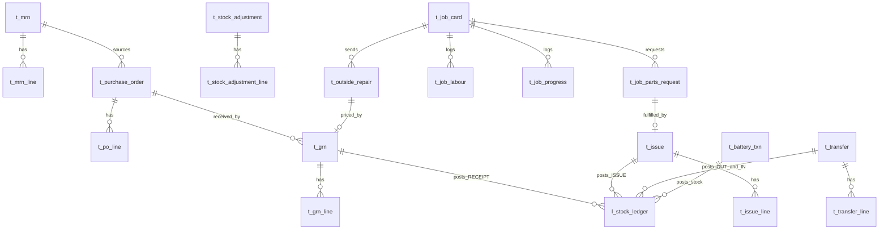

# 05 — Database Design: Transactions, Movements & the Universal Stock Ledger

This is the operational core. Everything here posts to **one ledger** and links back to masters
from [04](04-database-masters.md) via `source_doc_type` + `source_doc_id`.

## 5.1 The invariant

> **Every** receipt, issue, transfer, adjustment and return writes **at least one**
> `l_stock_ledger` row. Stock-on-hand is never a stored field to be edited — it is the running balance
> of this ledger. This single rule is what makes stock, valuation and traceability trustworthy
> (core rules 1 & 7).

## 5.2 `l_stock_ledger` — the heart

| Column | Type | Key | Notes |
|---|---|---|---|
| ledger_id | bigint | PK | immutable, append-only |
| item_id | bigint | FK→m_item | |
| location_id | bigint | FK→m_location | lowest stock level |
| movement_type | varchar(15) | FK→ref_movement_type | `OPENING`/`RECEIPT`/`ISSUE`/`TRANSFER_IN`/`TRANSFER_OUT`/`ADJUSTMENT`/`RETURN` |
| qty_in | numeric(18,4) | | 0 for outward moves |
| qty_out | numeric(18,4) | | 0 for inward moves |
| unit_cost | numeric(18,4) | | valuation cost of this move |
| movement_value | numeric(18,4) | | `(qty_in - qty_out) * unit_cost` |
| running_balance_qty | numeric(18,4) | | balance after this row (per item×location) |
| running_balance_value | numeric(18,4) | | value after this row |
| source_doc_type | varchar(20) | | `GRN`/`ISSUE`/`TRANSFER`/`ADJUSTMENT`/`BATTERY`/`OPENING` |
| source_doc_id | bigint | | header id of the causing document |
| source_doc_no | varchar(30) | | human doc number for reports |
| txn_date | date | | business date (drives price effective-date) |
| posted_at | timestamptz | | system post time |
| batch_no | varchar(30) | | lot/batch (optional) |
| reversed_flag | boolean | | true if superseded |
| reversal_of_ledger_id | bigint | FK→self | points to the row being reversed |
| created_by | bigint | FK→m_user | (audit cols apply) |

**Indexes:** `ix_ledger_item_loc_date(item_id, location_id, txn_date)`,
`ix_ledger_source(source_doc_type, source_doc_id)`, partial `ix_ledger_open` on non-reversed rows.

**Posting mechanics (service layer, one DB transaction):**
1. Lock the `(item_id, location_id)` balance row (advisory lock or `SELECT … FOR UPDATE` on latest ledger).
2. Compute `unit_cost` (WAC/FIFO — see [06](06-database-costing-history-approval.md)).
3. Insert the ledger row with recomputed `running_balance_qty/value`.
4. Update `l_stock_balance_month` running figures for the period.
5. If unpriced → also queue `c_pending_price`.

**Reversal, never delete:** to correct, insert a mirror row (`RETURN`/opposite signs) with
`reversal_of_ledger_id` set and mark the original `reversed_flag=true`. History stays intact (core rule 8).

## 5.3 `l_stock_balance_month` — frozen monthly snapshot

| Column | Type | Notes |
|---|---|---|
| balance_id | bigint PK | |
| item_id / location_id | bigint FK | |
| period_year / period_month | smallint | |
| opening_qty / opening_value | numeric(18,4) | carried from prior close |
| receipts_qty / issues_qty / adjust_qty / transfer_net_qty | numeric(18,4) | period movement |
| closing_qty / closing_value | numeric(18,4) | = opening + movements |
| avg_unit_cost | numeric(18,4) | WAC at close |
| is_closed | boolean | locks the period |

Unique `ux_balance_item_loc_period(item_id, location_id, period_year, period_month)`. Drives the
**monthly stock balance report** and the lubricant monthly book without re-scanning the whole ledger.

## 5.4 Transaction-layer ERD

## 5.5 Requisition & purchasing

### `t_mrn` / `t_mrn_line`
| `t_mrn` | Type | Notes |
|---|---|---|
| mrn_id | bigint PK | |
| mrn_no | varchar(30) UQ | `MRN-{SITE}-{YY}-{NNNNN}` |
| mrn_date | date | |
| site_id / location_id / department_id | bigint FK | demand origin |
| requested_by | bigint FK→m_employee | |
| purpose | varchar(200) | |
| status_code | varchar(20) | MRN flow |

| `t_mrn_line` | Type | Notes |
|---|---|---|
| mrn_line_id | bigint PK | |
| mrn_id | bigint FK | |
| item_id | bigint FK | |
| qty_requested / qty_issued | numeric(18,4) | |
| uom_id | bigint FK | |

### `t_purchase_order` / `t_po_line` (LPO & HPR)
| `t_purchase_order` | Type | Notes |
|---|---|---|
| po_id | bigint PK | |
| po_no | varchar(30) UQ | `LPO-…` or `HPR-…` |
| po_type | varchar(15) | `LOCAL`/`HEAD_OFFICE` |
| supplier_id | bigint FK | |
| po_date | date | |
| site_id | bigint FK | |
| mrn_id | bigint FK | sourcing MRN (optional) |
| total_value | numeric(18,4) | |
| status_code | varchar(20) | Purchase flow |

`t_po_line`: `po_line_id` PK, `po_id` FK, `item_id` FK, `qty`, `unit_price`, `uom_id`, `expected_date`,
`qty_received`.

## 5.6 Receiving & pricing

### `t_grn` / `t_grn_line`
| `t_grn` | Type | Notes |
|---|---|---|
| grn_id | bigint PK | |
| grn_no | varchar(30) UQ | `GRN-{SITE}-{YY}-{NNNNN}` |
| grn_date | date | receipt date |
| supplier_id | bigint FK | |
| po_id | bigint FK | null for direct receipts |
| job_card_id | bigint FK | set when parts bought for a job |
| received_by | bigint FK→m_employee | |
| location_id | bigint FK | receiving store |
| invoice_no | varchar(40) | |
| price_received_date | date | when priced (may lag receipt) |
| is_priced | boolean | false → queues pending price |
| status_code | varchar(20) | GRN flow |

| `t_grn_line` | Type | Notes |
|---|---|---|
| grn_line_id | bigint PK | |
| grn_id | bigint FK | |
| item_id | bigint FK | |
| qty_received | numeric(18,4) | |
| uom_id | bigint FK | receipt UoM (converted to stock UoM) |
| unit_cost | numeric(18,4) | null until priced |
| batch_no / expiry_date | varchar/date | |
| is_priced | boolean | line-level pricing |

**On GRN POST:** each priced line inserts a `RECEIPT` ledger row, updates WAC / creates a FIFO layer,
writes `h_price`, and sets `m_price` current. Unpriced lines still post stock (provisional cost) and
enqueue `c_pending_price` (so the item is available but flagged — core rule keeps stock moving while
protecting costing).

## 5.7 Issues (general, job, lubricant)

### `t_issue` / `t_issue_line`
| `t_issue` | Type | Notes |
|---|---|---|
| issue_id | bigint PK | |
| issue_no | varchar(30) UQ | `ISS-…` or `LUB-…` |
| issue_type | varchar(15) | `GENERAL`/`JOB`/`LUBRICANT` |
| issue_date | date | drives effective cost |
| location_id | bigint FK | source store |
| issued_by | bigint FK→m_employee | |
| job_card_id | bigint FK | set for `JOB` issues |
| asset_id | bigint FK→m_asset | vehicle/machine (lube & job) |
| project_id | bigint FK | attribution |
| department_id | bigint FK | attribution |
| site_id | bigint FK | |
| odometer | numeric(18,2) | lube: km at issue |
| machine_hours | numeric(18,2) | lube: hrs at issue |
| override_flag | boolean | true if issued despite short stock |
| override_by | bigint FK→m_user | authorizer of override |
| status_code | varchar(20) | Issue flow |

| `t_issue_line` | Type | Notes |
|---|---|---|
| issue_line_id | bigint PK | |
| issue_id | bigint FK | |
| item_id | bigint FK | |
| qty | numeric(18,4) | |
| uom_id | bigint FK | |
| unit_cost | numeric(18,4) | resolved at post |

**Insufficient-stock rule (core rule 2):** the service checks `running_balance_qty >= qty`. If not, the
issue is blocked *unless* `override_flag=true` with an `override_by` who holds the override permission;
the resulting ledger row carries status `OVERRIDE_ISSUED` and raises an exception alert.

**Lubricant traceability (core rule 5):** a `LUBRICANT` issue *requires* `asset_id` (or `project_id`)
+ `site_id` + `issue_date`, so every litre is attributable.

## 5.8 Transfers — two-sided posting

### `t_transfer` / `t_transfer_line`
| `t_transfer` | Type | Notes |
|---|---|---|
| transfer_id | bigint PK | |
| transfer_no | varchar(30) UQ | `TRF-{FROM}-{YY}-{NNNNN}` |
| transfer_date | date | |
| from_location_id / to_location_id | bigint FK | |
| transferred_by / received_by | bigint FK | |
| status_code | varchar(20) | Transfer flow |

`t_transfer_line`: `transfer_line_id` PK, `transfer_id` FK, `item_id` FK, `qty`, `uom_id`, `unit_cost`.

**Posting (core rule 7):** dispatch inserts a **`TRANSFER_OUT`** row at `from_location` (and optionally
moves qty to virtual `IN_TRANSIT`); receipt inserts the paired **`TRANSFER_IN`** row at `to_location`
at the **same `unit_cost`**. Total inventory value is conserved; "transfer volume by location" reads
these paired rows.

## 5.9 Adjustments

`t_stock_adjustment` (`adjustment_id` PK, `adj_no` UQ, `adj_date`, `location_id` FK, `reason_code`
FK→ref_reason, `status_code`, `approved_by`) / `t_stock_adjustment_line` (`item_id`, `system_qty`,
`counted_qty`, `variance_qty`, `unit_cost`). On POST, variance writes an `ADJUSTMENT` ledger row.
Adjustments require approval (segregation of duties) before posting.

## 5.10 Job-card transaction cluster

### `t_job_card` (header)
| Column | Type | Notes |
|---|---|---|
| job_card_id | bigint PK | |
| jc_no | varchar(30) UQ | `JC-{SITE}-{YY}-{NNNNN}` |
| jc_date | date | |
| asset_id | bigint FK→m_asset | the vehicle/machine |
| complaint | varchar(500) | reported problem |
| priority | varchar(10) | LOW/MED/HIGH/CRITICAL |
| site_id / department_id | bigint FK | |
| reported_by / transport_officer_id | bigint FK→m_employee | |
| tm_approved_by / tm_approved_at | bigint/timestamptz | Level-1 |
| om_approved_by / om_approved_at | bigint/timestamptz | Level-2 |
| workshop_supervisor_id | bigint FK | |
| bay_no | varchar(10) | |
| planned_start / planned_end | date | schedule |
| actual_start / actual_end | date | reality → drives `DELAYED` |
| estimated_cost | numeric(18,4) | for variance |
| closed_by / closed_at | bigint/timestamptz | |
| status_code | varchar(20) | Job Card flow |

### Job children
| Table | Key columns |
|---|---|
| `t_job_task` | `task_id` PK, `job_card_id` FK, `description`, `assigned_to` FK→m_employee, `status` |
| `t_job_progress` | `progress_id` PK, `job_card_id` FK, `log_date`, `work_done` text, `hours`, `entered_by` |
| `t_job_parts_request` | `request_id` PK, `job_card_id` FK, `item_id` FK, `qty_requested`, `request_type` (`INTERNAL`/`EXTERNAL`), `source` (`STOCK`/`PURCHASE`), `issue_id` FK, `grn_id` FK, `status_code` |
| `t_job_labour` | `labour_id` PK, `job_card_id` FK, `employee_id` FK, `work_date`, `hours`, `hourly_rate`, `line_cost`, `remarks` |
| `t_outside_repair` | `outside_repair_id` PK, `or_no` UQ (`OR-{YY}-{NNNNN}`), `job_card_id` FK, `supplier_id` FK, `description`, `sent_date`, `expected_date`, `received_date`, `quoted_cost`, `actual_cost`, `grn_id` FK, `status_code` |

**Material for a job** flows: `t_job_parts_request` → if `STOCK`, a `t_issue (JOB)` fulfils it (posts
`ISSUE` ledger + MATERIAL cost); if `PURCHASE`, an LPO/HPR + `t_grn (job_card_id)` brings it in, then
issue. **Outside repair** cost enters costing when its GRN/invoice is priced.

## 5.11 Battery transactions

### `t_battery_txn`
| Column | Type | Notes |
|---|---|---|
| battery_txn_id | bigint PK | |
| txn_no | varchar(30) UQ | `BAT-{YY}-{NNNNN}` |
| txn_type | varchar(15) | `PUNCH`/`ISSUE`/`TRANSFER`/`RETURN`/`REPLACEMENT`/`SCRAP`/`WARRANTY`/`REPAIR` |
| battery_id | bigint FK→m_battery | the serial |
| from_asset_id / to_asset_id | bigint FK→m_asset | movement endpoints |
| job_card_id | bigint FK | if done under a job |
| txn_date | date | |
| odometer | numeric(18,2) | at swap |
| reason | varchar(200) | |
| supplier_id | bigint FK | warranty/repair vendor |
| status_code | varchar(20) | Battery flow |

On POST: updates `m_battery.current_asset_id/current_status`, appends `h_battery_movement` (immutable),
appends `h_battery_lifecycle` on status change, and — where battery *stock* is consumed from a store —
posts an `ISSUE` ledger row. Full serial lineage is preserved (core rule 4; details in [06](06-database-costing-history-approval.md)).

## 5.12 Drill-down / traceability

Because every ledger and costing row carries `source_doc_type` + `source_doc_id` + `source_doc_no`,
the UI supports **two-way trace**: open a GRN → see its RECEIPT rows and any job it fed; open a KPI tile
→ drill to the exact document. This is the data backbone for [09 — Dashboards](09-dashboards-and-kpis.md)
and [13 — Reports](13-reports-and-documents.md).
