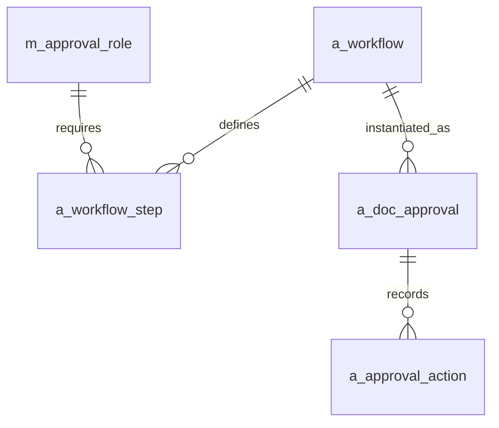
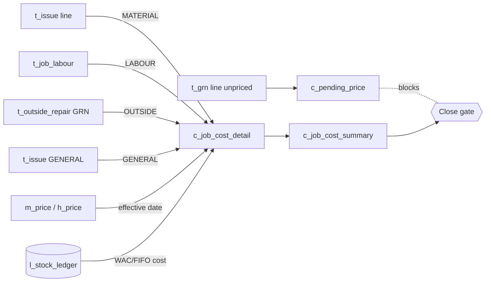

# 06 — Database Design: Costing, History, Approvals, Valuation & Serial Tracking

## 6.1 Costing tables

### `c_job_cost_detail` — cost lines with price provenance
| Column | Type | Notes |
|---|---|---|
| cost_detail_id | bigint PK | |
| job_card_id | bigint FK→t_job_card | |
| cost_element | varchar(15) | `LABOUR`/`MATERIAL`/`GENERAL`/`OUTSIDE` |
| source_doc_type | varchar(20) | `ISSUE`/`LABOUR`/`GRN`/`OUTSIDE_REPAIR` |
| source_doc_id | bigint | line-level link |
| item_id | bigint FK | null for labour/outside |
| qty | numeric(18,4) | |
| unit_cost | numeric(18,4) | resolved cost |
| line_cost | numeric(18,4) | `qty * unit_cost` |
| price_source | varchar(20) | `WAC`/`FIFO`/`EFFECTIVE_PRICE`/`INVOICE`/`RATE` |
| effective_price_date | date | date used for resolution |
| is_provisional | boolean | true if price still pending |
| posted_at | timestamptz | |

### `c_job_cost_summary` — rolled-up cost per job
| Column | Type | Notes |
|---|---|---|
| cost_summary_id | bigint PK | |
| job_card_id | bigint FK UQ | one per job |
| labour_cost / material_cost / general_cost / outside_cost | numeric(18,4) | element rollups |
| total_cost | numeric(18,4) | sum of elements |
| estimated_cost | numeric(18,4) | from `t_job_card` |
| variance_amount | numeric(18,4) | `total_cost - estimated_cost` |
| variance_pct | numeric(9,4) | `variance_amount / nullif(estimated_cost,0)` |
| has_provisional | boolean | any provisional line? blocks final |
| is_final | boolean | set true at COSTED/CLOSED |
| computed_at | timestamptz | last recompute |

> `c_job_cost_summary` is recomputed (trigger or service) whenever a `c_job_cost_detail` row is added
> for the job — the cost **assembles itself** as work happens. Formulas live in [08 — Costing Logic](08-costing-logic.md).

### `c_pending_price` — the valuation queue
| Column | Type | Notes |
|---|---|---|
| pending_price_id | bigint PK | |
| source_doc_type | varchar(20) | `GRN`/`ISSUE`/`OUTSIDE_REPAIR` |
| source_doc_id | bigint | |
| item_id | bigint FK | |
| qty | numeric(18,4) | |
| provisional_cost | numeric(18,4) | placeholder used meanwhile |
| reason | varchar(120) | `NO_PRICE`/`AWAITING_INVOICE` |
| flagged_at | timestamptz | |
| resolved_flag | boolean | |
| resolved_at | timestamptz | |
| resolved_price | numeric(18,4) | |

A job with any unresolved `c_pending_price` cannot close (core rule 3). Resolving a row **trues up** the
ledger `unit_cost`, the `c_job_cost_detail` line, and `c_job_cost_summary`.

## 6.2 Valuation

Default method: **Weighted Average Cost (WAC)** per `item_id × location_id`. Optional **FIFO** per item
category (`m_item.valuation_method = 'FIFO'`).

### Weighted Average Cost

On each **receipt**:
```
new_avg = (old_qty * old_avg + received_qty * received_unit_cost)
          / (old_qty + received_qty)
```
On each **issue**: `unit_cost = current_avg` (the average is not changed by an issue).

**Worked example (WAC):**
| Event | Qty | Unit cost | Balance qty | Balance value | Avg |
|---|---|---|---|---|---|
| Opening | 100 | 50.00 | 100 | 5,000.00 | 50.00 |
| Receipt | 100 | 60.00 | 200 | 11,000.00 | **55.00** |
| Issue | −80 | 55.00 | 120 | 6,600.00 | 55.00 |
| Receipt | 50 | 58.00 | 170 | 9,500.00 | **55.88** |

### FIFO (optional, layered)

`c_fifo_layer` holds cost layers; issues consume oldest layers first.
| Column | Type | Notes |
|---|---|---|
| layer_id | bigint PK | |
| item_id / location_id | bigint FK | |
| grn_id | bigint FK | origin receipt |
| received_qty / remaining_qty | numeric(18,4) | |
| unit_cost | numeric(18,4) | |
| received_date | date | FIFO ordering |

**Worked example (FIFO):** layers L1=100@50, L2=100@60. Issue 120 → 100 from L1 (5,000) + 20 from L2
(1,200) = **6,200**, weighted `51.67`. L2 remaining = 80@60. FIFO cost of goods reflects real lot costs;
WAC smooths. The system supports both; recommend **WAC as default** (simpler, matches how most stores
already think) with FIFO reserved for high-value serialized-ish categories.

## 6.3 Effective-date price resolution

Cost of a material line is resolved **as of the transaction date**:

```sql
-- price applicable to item on a given business date
SELECT unit_price
FROM   m_price
WHERE  item_id = :item_id
  AND  price_type = 'PURCHASE'
  AND  :txn_date >= effective_from
  AND  :txn_date <  coalesce(effective_to, DATE '9999-12-31')
ORDER  BY effective_from DESC
LIMIT  1;
```
Precedence when both exist: **WAC/FIFO ledger cost** for issues out of stock; **effective `m_price`** when
no on-hand cost basis exists (e.g. direct-to-job purchase). Full rules and tie-breaks in
[08 — Costing Logic](08-costing-logic.md).

## 6.4 Serial tracking & full battery lineage (core rule 4)

### `h_battery_movement` — immutable movement lineage
| Column | Type | Notes |
|---|---|---|
| history_id | bigint PK | append-only |
| battery_id | bigint FK→m_battery | |
| battery_txn_id | bigint FK→t_battery_txn | causing txn |
| event_type | varchar(15) | mirrors txn_type |
| from_asset_id / to_asset_id | bigint FK→m_asset | |
| event_date | date | |
| odometer | numeric(18,2) | |
| notes | varchar(200) | |
| done_by | bigint FK→m_user | |

### `h_battery_lifecycle` — status/warranty events
| Column | Type | Notes |
|---|---|---|
| lifecycle_id | bigint PK | |
| battery_id | bigint FK | |
| event_type | varchar(15) | `PUNCH`/`TRANSFER`/`RETURN`/`REPLACEMENT`/`SCRAP`/`WARRANTY`/`REPAIR` |
| status_from / status_to | varchar(20) | |
| event_date | date | |
| warranty_flag | boolean | within warranty at event? |
| cost | numeric(18,4) | repair/replacement cost |
| notes | varchar(200) | |

**Reconstruct one battery's entire life:**
```sql
SELECT hbm.event_date, hbm.event_type,
       fa.asset_code AS from_vehicle, ta.asset_code AS to_vehicle,
       hbm.odometer
FROM   h_battery_movement hbm
LEFT   JOIN m_asset fa ON fa.asset_id = hbm.from_asset_id
LEFT   JOIN m_asset ta ON ta.asset_id = hbm.to_asset_id
WHERE  hbm.battery_id = (SELECT battery_id FROM m_battery WHERE serial_no = :serial)
ORDER  BY hbm.event_date, hbm.history_id;
```
Because `h_battery_movement` is append-only and `m_battery` keeps `original_asset_id` forever, the chain
**punch → transfer(s) → return → replacement/scrap/warranty** is never broken, even as the physical
battery moves across many vehicles.

## 6.5 Price history — `h_price`

| Column | Type | Notes |
|---|---|---|
| price_history_id | bigint PK | append-only |
| item_id | bigint FK | |
| price_type | varchar(20) | |
| unit_price | numeric(18,4) | |
| effective_from / effective_to | date | closed range when superseded |
| source_doc_type / source_doc_id | varchar/bigint | GRN/MANUAL/MIGRATION |
| created_by / created_at | bigint/timestamptz | |

Every price change appends here and closes the prior open range (`effective_to = new.effective_from - 1`).
This backs the **lubricant price history** report and effective-date costing.

## 6.6 Approval engine



### `a_workflow` / `a_workflow_step`
| `a_workflow` | Type | Notes |
|---|---|---|
| workflow_id | bigint PK | |
| workflow_code | varchar(20) UQ | `JC_APPROVAL`, `PO_APPROVAL` |
| doc_type | varchar(20) | `JOB_CARD`/`PURCHASE`/`ADJUSTMENT` |
| is_active | boolean | |

| `a_workflow_step` | Type | Notes |
|---|---|---|
| step_id | bigint PK | |
| workflow_id | bigint FK | |
| step_no | smallint | order |
| approval_role_id | bigint FK→m_approval_role | e.g. transport_manager |
| min_value / max_value | numeric(18,4) | value-based routing |
| sla_hours | smallint | breach → alert |
| is_mandatory | boolean | |

### `a_doc_approval` / `a_approval_action`
| `a_doc_approval` | Type | Notes |
|---|---|---|
| doc_approval_id | bigint PK | |
| workflow_id | bigint FK | |
| doc_type | varchar(20) | |
| doc_id | bigint | e.g. job_card_id |
| current_step_no | smallint | |
| status | varchar(15) | `PENDING`/`APPROVED`/`REJECTED`/`RETURNED` |
| requested_by / requested_at | bigint/timestamptz | |

| `a_approval_action` | Type | Notes |
|---|---|---|
| action_id | bigint PK | |
| doc_approval_id | bigint FK | |
| step_no | smallint | |
| action | varchar(10) | `APPROVE`/`REJECT`/`RETURN` |
| acted_by / acted_at | bigint/timestamptz | |
| comments | varchar(300) | |

Job-card two-level approval (`TM_APPROVED → OM_APPROVED`) is just a `JC_APPROVAL` workflow with two
steps; purchases use value-banded steps. The engine is **data-driven** — add/reorder steps without code.

## 6.7 Universal audit — `h_audit_log`

| Column | Type | Notes |
|---|---|---|
| audit_id | bigint PK | |
| table_name | varchar(60) | |
| record_id | bigint | affected row PK |
| action | varchar(10) | `INSERT`/`UPDATE`/`DELETE`/`APPROVE`/`REVERSE` |
| changed_by | bigint FK→m_user | |
| changed_at | timestamptz | |
| old_values | jsonb | pre-image |
| new_values | jsonb | post-image |
| source_doc_no | varchar(30) | for report readability |

Populated by DB triggers on all `t_*`, `m_*`, `l_*` tables. Combined with the per-row audit columns,
this fully satisfies core rule 8 and powers the **audit trail report** ([13](13-reports-and-documents.md)).

## 6.8 How it all ties together


