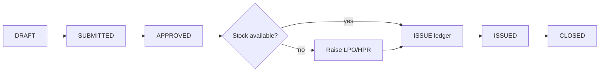
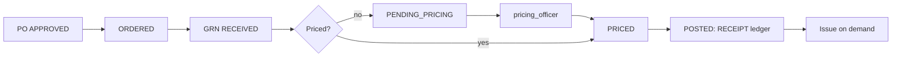
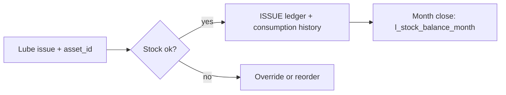
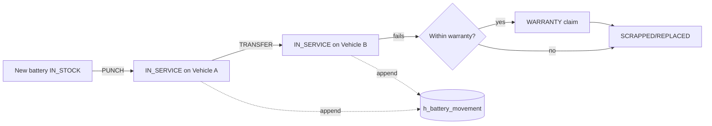
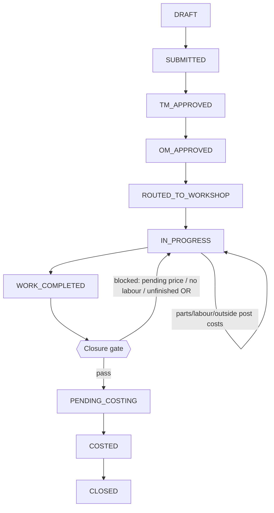
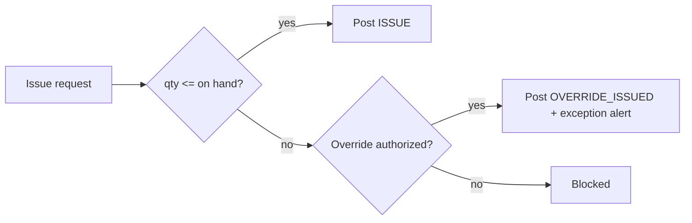

# 07 — Workflow Design

Each workflow lists **steps (actor · action · system effect · resulting status)**, its **status flow**
(from [00 §0.9](00-foundation-and-standards.md)), and a **flow diagram**. Roles are from [00 §0.12].

---

## (a) MRN → Receipt → Stock

**Status flow:** `DRAFT → SUBMITTED → APPROVED → PARTIALLY_ISSUED → ISSUED → CLOSED`

| # | Actor | Action | System effect | Status |
|---|---|---|---|---|
| 1 | store_keeper | Create MRN for site/dept needs | `t_mrn` + lines created | `DRAFT` |
| 2 | store_keeper | Submit | Approval doc opened | `SUBMITTED` |
| 3 | inventory_controller | Approve demand | `a_approval_action` APPROVE | `APPROVED` |
| 4 | store_keeper | Issue available stock against MRN | `t_issue` → `ISSUE` ledger rows | `PARTIALLY_ISSUED`/`ISSUED` |
| 5 | store_keeper | Shortfall → raise purchase | LPO/HPR created (workflow b/c) | (MRN stays open) |
| 6 | system | All lines issued | — | `CLOSED` |

---

## (b) Local Purchase → GRN → Pricing → Issue

**PO flow:** `DRAFT → SUBMITTED → APPROVED → ORDERED → PARTIALLY_RECEIVED → RECEIVED → CLOSED`
**GRN flow:** `DRAFT → RECEIVED → PENDING_PRICING → PRICED → POSTED`

| # | Actor | Action | System effect | Status |
|---|---|---|---|---|
| 1 | store_keeper | Raise LPO (from MRN shortfall) | `t_purchase_order (LOCAL)` | PO `DRAFT→SUBMITTED` |
| 2 | inventory_controller/finance | Approve (value-banded) | `a_approval_action` | PO `APPROVED→ORDERED` |
| 3 | receiving_clerk | Receive goods, record qty | `t_grn` + lines | GRN `RECEIVED` |
| 4 | system | Price present? | if no → queue | GRN `PENDING_PRICING` |
| 5 | pricing_officer | Enter unit cost + `price_received_date` | `m_price`+`h_price`; clear `c_pending_price` | GRN `PRICED` |
| 6 | system | Post receipt | `RECEIPT` ledger; WAC/FIFO update | GRN `POSTED`; PO `RECEIVED` |
| 7 | store_keeper | Issue to demand | `ISSUE` ledger + costing | Issue `POSTED` |

---

## (c) Head-Office Purchase → Receipt → Stock

**Flow:** `HPR DRAFT → SUBMITTED → APPROVED → ORDERED → RECEIVED → CLOSED`, GRN as (b).

| # | Actor | Action | System effect | Status |
|---|---|---|---|---|
| 1 | store_keeper | Raise HPR (head-office sourced) | `t_purchase_order (HEAD_OFFICE)` | `SUBMITTED` |
| 2 | operational_manager | Approve HO requisition | `a_approval_action` | `APPROVED→ORDERED` |
| 3 | receiving_clerk | Receive against HPR (may arrive pre-priced from HO) | `t_grn`; if priced → straight to `PRICED` | GRN `RECEIVED/PRICED` |
| 4 | system | Post | `RECEIPT` ledger; HO transfer price honoured | GRN `POSTED` |

> HO receipts often arrive **already priced** (internal transfer price); the GRN skips
> `PENDING_PRICING` and posts directly, writing `h_price` with `source_doc_type='GRN'`.

---

## (d) Lubricant Issue → Monthly Balance

**Flow:** `Issue DRAFT → ISSUED → POSTED`; month close writes `l_stock_balance_month`.

| # | Actor | Action | System effect | Status |
|---|---|---|---|---|
| 1 | lubricant_officer | Issue lube to vehicle/machine | `t_issue (LUBRICANT)` with `asset_id`,`site_id`,`odometer` | `ISSUED` |
| 2 | system | Check stock; post | `ISSUE` ledger; consumption tagged to asset | `POSTED` |
| 3 | system | Abnormal vs asset average? | raise alert | (flag) |
| 4 | inventory_controller | Month-end close | freeze `l_stock_balance_month` (opening/closing/avg) | period `is_closed` |

Consumption feeds **days-of-cover** and **average usage (L/1000km, L/machine-hr)** KPIs.

---

## (e) Battery Issue / Transfer / Replacement / History

**Flow:** `Battery DRAFT → CONFIRMED → POSTED`

| Scenario | Actor | Action | System effect | Status |
|---|---|---|---|---|
| Punch/Issue | battery_custodian | Assign new battery to vehicle | `t_battery_txn (PUNCH)`; `m_battery.current_asset_id` set; `h_battery_movement`; stock `ISSUE` | `POSTED` |
| Transfer | battery_custodian | Move battery vehicle→vehicle | `t_battery_txn (TRANSFER)`; `from/to_asset`; `h_battery_movement` | `POSTED` |
| Replacement | workshop_supervisor | Swap failed battery | `REPLACEMENT` txn; old→`RETURNED`; new punched; both lineages kept | `POSTED` |
| Warranty | battery_custodian + finance | Claim within warranty | `WARRANTY` txn; `h_battery_lifecycle warranty_flag=true`; supplier claim | `POSTED` |
| Scrap | battery_custodian + finance | Retire | `SCRAP` txn; `current_status=SCRAPPED` | `POSTED` |

Serial lineage (core rule 4) is preserved regardless of path.

---

## (f) Job Card: Approval → Execution → Costing → Closure

**Flow:** `DRAFT → SUBMITTED → TM_APPROVED → OM_APPROVED → ROUTED_TO_WORKSHOP → IN_PROGRESS → WORK_COMPLETED → PENDING_COSTING → COSTED → CLOSED`

| # | Actor | Action | System effect | Status |
|---|---|---|---|---|
| 1 | transport_officer | Create job card for vehicle | `t_job_card` | `DRAFT→SUBMITTED` |
| 2 | transport_manager | Approve (L1) | `a_approval_action`; `tm_approved_*` | `TM_APPROVED` |
| 3 | operational_manager | Approve (L2) | `om_approved_*` | `OM_APPROVED` |
| 4 | workshop_supervisor | Route to bay/technician | supervisor+bay set | `ROUTED_TO_WORKSHOP` |
| 5 | technician | Start work; log daily progress | `actual_start`; `t_job_progress` | `IN_PROGRESS` |
| 6 | supervisor/technician | Request & consume parts | `t_job_parts_request`→`t_issue`; MATERIAL cost | (in progress) |
| 7 | technician | Log labour hours | `t_job_labour`; LABOUR cost | (in progress) |
| 8 | supervisor | Send/receive outside repair | `t_outside_repair`→GRN; OUTSIDE cost | (in progress) |
| 9 | supervisor | Mark work done | `actual_end` | `WORK_COMPLETED` |
| 10 | system | Run closure gate | check parts/prices/labour/outside/approvals | `PENDING_COSTING` |
| 11 | pricing_officer | Clear any pending prices | `c_pending_price` resolved; true-up | (gate passes) |
| 12 | finance_reviewer | Review cost vs estimate | `c_job_cost_summary` variance | `COSTED` |
| 13 | finance_reviewer/supervisor | Close | `closed_*` set | `CLOSED` |

**Closure gate** (`fn_can_close_job`) blocks close unless: all parts issued/received/written-off · no
`c_pending_price` for the job · labour captured · every `t_outside_repair` `COSTED` · approvals complete.

---

## (g) Outside / Subcontract Repair

**Flow:** `REQUESTED → APPROVED → SENT → IN_PROGRESS → RECEIVED → INVOICED → COSTED → CLOSED`

| # | Actor | Action | System effect | Status |
|---|---|---|---|---|
| 1 | workshop_supervisor | Raise outside repair on a job | `t_outside_repair` (supplier=SUBCONTRACTOR) | `REQUESTED` |
| 2 | operational_manager | Approve send-out (value-banded) | `a_approval_action` | `APPROVED` |
| 3 | supervisor | Dispatch part/assembly | `sent_date` | `SENT` |
| 4 | subcontractor | Perform work | — | `IN_PROGRESS` |
| 5 | receiving_clerk | Receive back + invoice | `t_grn (job_card_id)` linked to OR | `RECEIVED→INVOICED` |
| 6 | pricing_officer | Price the invoice | `actual_cost`; OUTSIDE `c_job_cost_detail` | `COSTED` |
| 7 | system | Roll into job cost | `c_job_cost_summary.outside_cost` | `CLOSED` |

---

## (h) Material Request linked to Job Card

**Flow:** `REQUESTED → APPROVED → SOURCING → ISSUED`/`PURCHASED → RECEIVED → CLOSED`

| # | Actor | Action | System effect | Status |
|---|---|---|---|---|
| 1 | technician/supervisor | Request part on job | `t_job_parts_request` | `REQUESTED` |
| 2 | store_keeper | Check on-hand | balance query on `l_stock_ledger` | `APPROVED` |
| 3a | store_keeper | In stock → issue | `t_issue (JOB)`→`ISSUE` ledger + MATERIAL cost; `issue_id` linked | `ISSUED` |
| 3b | store_keeper | Not in stock → purchase | LPO/HPR + `t_grn (job_card_id)` | `SOURCING→PURCHASED→RECEIVED` |
| 4 | system | Post cost to job | `c_job_cost_detail (MATERIAL)` | `CLOSED` |

---

## Insufficient-stock override (applies to any issue)

Overrides require the `stock.override` permission, stamp `override_by`, set status `OVERRIDE_ISSUED`,
and raise an exception (core rule 2). No silent negative stock.
