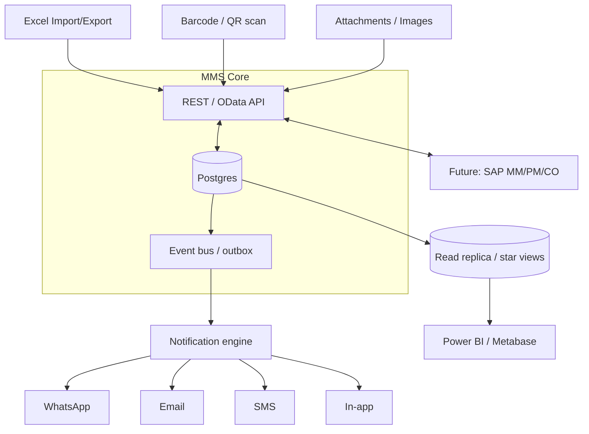

# 14 — Integration Architecture

The MMS is built **API-first and event-driven** so today's needs (Excel, QR, alerts) and tomorrow's
(Power BI, SAP) plug into the same core without rework.

## 14.1 Excel import / export
- **Templated round-trip:** each importable object has a downloadable template mirroring `stg_*`.
  Uploads land in staging, run the [migration validation rules](11-data-migration-strategy.md), and show
  an error report before any commit. Same pipeline serves ongoing bulk loads, not just first migration.
- **Export:** every grid → Excel/CSV of the current filtered view; reports → formatted workbook.

## 14.2 Barcode / QR support
- Print **item/bin labels** (item_code + `m_item.barcode`) and **battery serial QR**.
- **Scan-to-act:** scan an item to open it; scan during issue to add a line; scan a battery serial to
  open its lifecycle; scan a bin to confirm location. Speeds shop-floor posting and kills mis-keys.

## 14.3 Attachments & battery image proof
- Generic attachment service on GRN, job card, outside repair (invoices, quotes, photos).
- **Battery serial-plate image** (`m_battery.image_url`): capture from phone at punch; store original +
  thumbnail; keep EXIF date as evidence. Supports warranty disputes and audit.
- Storage abstraction (local/S3-compatible); URLs, not blobs, in the DB.

## 14.4 Notification engine
Event → rule → channel → recipient, driven by the **transactional outbox** so no event is lost.
- Sources: postings (override used, GRN unpriced), schedules (warranty due, days-of-cover), workflow
  (approval pending, SLA breach).
- Rules configurable per alert (threshold, severity, channel, recipient role) — see
  [09 §9.6](09-dashboards-and-kpis.md).

## 14.5 WhatsApp / Email / SMS hooks
- Pluggable channel adapters behind the notification engine (WhatsApp Business API, SMTP, SMS gateway).
- Use cases: approval requests to managers, low-stock to stores, warranty-due to custodian, job-overdue
  to supervisor. Delivery status tracked; retries with backoff.

## 14.6 API readiness (REST/OData)
- **Resources:** `/items`, `/suppliers`, `/assets`, `/locations`, `/stock-ledger`, `/mrn`, `/grn`,
  `/issues`, `/transfers`, `/job-cards`, `/battery-txns`, `/job-costs`, `/approvals`, `/reports/*`.
- **Auth:** OAuth2 / JWT, RBAC-scoped; **versioned** (`/v1`); **idempotency keys** on all posting
  endpoints (a retried GRN post never double-posts the ledger).
- Read endpoints support OData-style `$filter/$select/$expand` for BI tools.

## 14.7 Power BI / analytics
- **Read replica** + curated **star-schema views** (`v_fact_ledger`, `v_fact_jobcost`, `dim_item`,
  `dim_asset`, `dim_supplier`, `dim_date`) so analysts never hit the transactional DB.
- Certified datasets for stock value, consumption, job cost, supplier spend; the in-app dashboards and
  BI read the *same* facts, so numbers reconcile.

## 14.8 Future SAP integration
Design objects to map cleanly to SAP so a later migration/coexistence is an interface, not a rebuild:

| MMS object | SAP equivalent | Interface |
|---|---|---|
| `m_item` | Material Master (MM) | BAPI_MATERIAL_SAVEDATA / IDoc MATMAS |
| `m_supplier` | Vendor / Business Partner | IDoc CREMAS |
| `t_grn` | Goods Receipt (MIGO / MB01) | BAPI_GOODSMVT_CREATE |
| `t_purchase_order` | Purchase Order (ME21N) | IDoc ORDERS / BAPI_PO_CREATE |
| `t_job_card` | Maintenance Order (PM) | IDoc / BAPI_ALM_ORDER |
| `m_asset` (vehicle/machine) | Equipment / Functional Location (PM) | IDoc EQUIPMENT |
| `c_job_cost_*` | Cost Object / Internal Order (CO) | BAPI cost postings |
| `l_stock_ledger` | Material Document / stock | BAPI_GOODSMVT / MB51 reconcile |

Approach: OData/IDoc/BAPI adapters behind the same API layer; MMS can run as the operational front-end
feeding SAP as the financial system of record, or hand over module-by-module.
