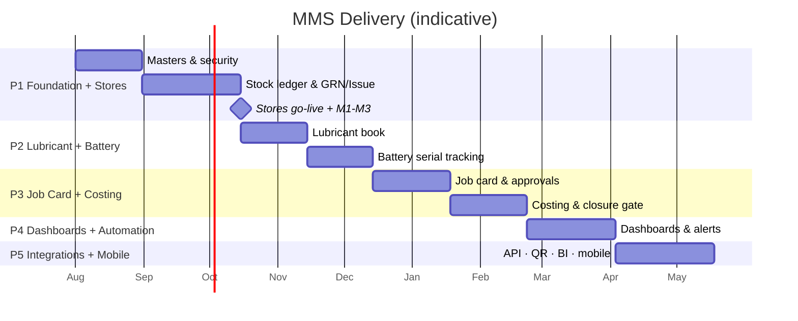
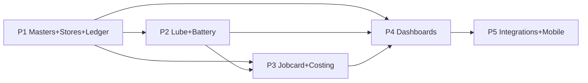

# 15 — Implementation Roadmap

Sequencing rule: **masters and the stock ledger must exist before anything can be costed.** Each phase
delivers usable value and sets the foundation for the next.

## Phase 1 — Foundation Masters + Stores/MM
- **Scope:** all master data, RBAC/security, `l_stock_ledger`, MRN, LPO/HPR, GRN + pricing, issues,
  transfers, adjustments, stock balance, movement history, numbering engine, audit log.
- **Data/migration:** M1 masters → M2 prices → M3 opening stock.
- **Enables:** accurate live stock, valuation, receipts/issues, movement traceability.
- **Exit criteria:** opening stock reconciled to zero variance; every movement posts a ledger row;
  stores operating fully in MMS.
- **Team:** architect, 2 backend, 1 frontend, DBA, inventory_controller (SME), tester.
- **Risks:** master de-duplication effort; opening-balance accuracy → mitigate with parallel run.

## Phase 2 — Lubricant + Battery
- **Scope:** lubricant product detail, lube issues with asset mapping, monthly balance, reorder alerts;
  battery register, serial tracking, punch/transfer/return/warranty, lifecycle & history.
- **Data/migration:** M4 battery serials + history; historic lube issues (optional).
- **Enables:** consumption traceability by asset/site; serial-true battery lifecycle.
- **Exit criteria:** every in-service battery has a current asset + unbroken lineage; lube days-of-cover live.
- **Depends on:** P1 ledger & assets.

## Phase 3 — Job Card + Costing
- **Scope:** job card creation & two-level approval, workshop routing, progress log, parts requests,
  labour, outside repair, self-assembling costing, closure gate.
- **Data/migration:** M5 open job cards with partial costs.
- **Enables:** true final job cost; estimated-vs-actual variance; "job cost by vehicle".
- **Exit criteria:** a job cannot close with pending price / missing labour / uncosted outside repair;
  cost sheet reconciles to postings.
- **Depends on:** P1 (issues/ledger), P2 (assets, lube, battery costs feed jobs).

## Phase 4 — Dashboards, Analytics & Advanced Automation
- **Scope:** executive + operational dashboards, KPI views, alert/notification rules, exception
  monitoring, scheduled reports, forecasting/reorder automation.
- **Enables:** management visibility, proactive alerts, exception-driven operations.
- **Exit criteria:** KPIs reconcile to source tables; alerts firing to correct roles.
- **Depends on:** P1–P3 data.

## Phase 5 — Integrations & Mobile
- **Scope:** REST/OData API, barcode/QR scan-to-act, attachment/image service, WhatsApp/email/SMS
  channels, Power BI star views, mobile-optimized shop-floor & manager experiences; SAP-readiness.
- **Enables:** faster posting, remote approvals, BI, future ERP path.
- **Depends on:** stable P1–P4.

## Cross-phase dependencies

## Change management & training
- Role-based training tracks (clerk quick-start; manager approvals & dashboards; admin config).
- Parallel-run period per phase with side-by-side reconciliation before old book retirement.
- "Golden path" job aids for the 5 daily clerk actions; super-user per site.
- Feedback loop: exception dashboard reviewed weekly in first 90 days to tune thresholds & workflows.
