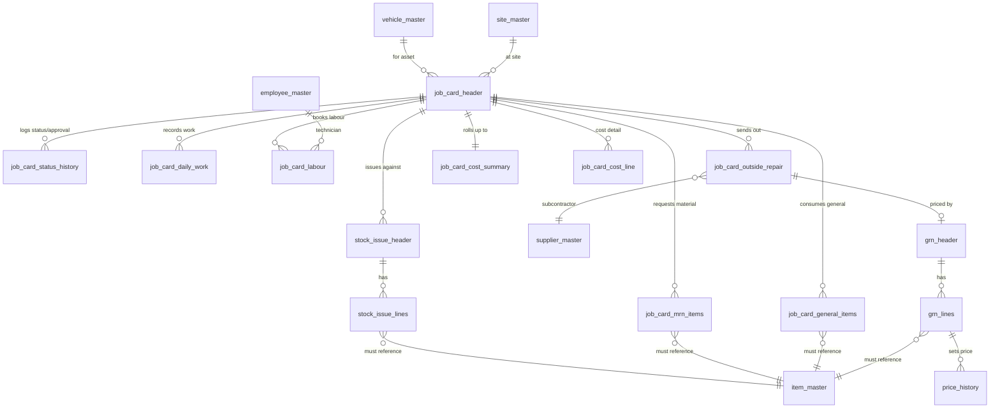
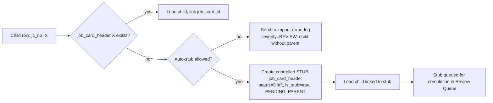
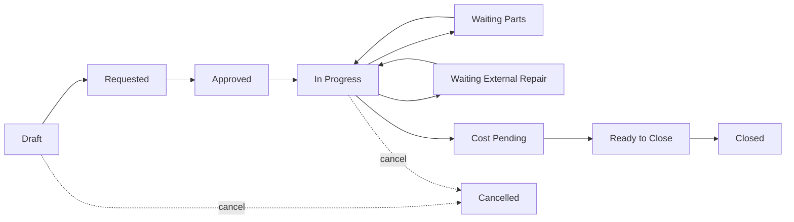

# Job-Card-Centric Import & Data Model

> **The job card is the master transaction object.** Every MRN item, general item, daily work entry,
> labour line, outside repair, stock issue, receipt, price event and cost figure is linked to — and
> traceable back to — exactly one `job_card_header`. This document uses your table names as canonical;
> §0.1 maps them to the existing blueprint foundation so the two remain consistent.

## 0.1 Naming reconciliation (this doc ↔ blueprint foundation)

| This document | Blueprint equivalent ([00 Foundation](00-foundation-and-standards.md)) |
|---|---|
| `job_card_header` | `t_job_card` |
| `job_card_status_history` | status/approval trail (`a_doc_approval` + `a_approval_action`) |
| `job_card_mrn_items` | `t_mrn_line` / `t_job_parts_request` (job-linked) |
| `job_card_general_items` | `t_issue(GENERAL)` lines (job-linked) |
| `job_card_daily_work` | `t_job_progress` |
| `job_card_labour` | `t_job_labour` |
| `job_card_outside_repair` | `t_outside_repair` |
| `job_card_cost_summary` / `job_card_cost_line` | `c_job_cost_summary` / `c_job_cost_detail` |
| `stock_issue_header` / `_lines` | `t_issue` / `t_issue_line` |
| `grn_header` / `_lines` | `t_grn` / `t_grn_line` |
| `price_history` | `h_price` (+ current `m_price`) |
| `import_batch_log` / `import_error_log` | staging `load_batch_id` / `stg_*.row_status` |

Conventions: `lower_snake_case`; surrogate PK `bigint identity` named `<table>_id`; business keys unique;
money/qty `numeric(18,4)`; standard audit columns on every table (`created_by, created_at, updated_by,
updated_at, is_active`); **reverse-not-delete**.

---

## 1. Master data model

Every transactional/child record references these masters — **no free-text** for material, vehicle,
site, supplier or technician.

| Master | PK | Business key | Major fields |
|---|---|---|---|
| **vehicle_master** | vehicle_id | vehicle_code / reg_no (UQ) | make, model, year, chassis_no, engine_no, site_id, department_id, asset_type(VEHICLE/MACHINE), odometer, hours_meter, status |
| **item_master** (material) | item_id | item_code (UQ) | description, item_category_id, stock_uom_id, item_type(STOCK/SERIALIZED), valuation_method(WAC/FIFO), reorder_level, barcode, is_active |
| **general_item_master** | item_id | item_code (UQ) | *(same table as item_master with `item_type=GENERAL`/category GENERAL — one item master, filtered view; not a duplicate list)* |
| **site_master** | site_id | site_code (UQ) | name, region, parent_location_id, location_type(SITE/STORE/WORKSHOP/BIN) |
| **employee_master** (technician) | employee_id | employee_code (UQ) | full_name, designation, department_id, site_id, is_technician, default_hourly_rate |
| **supplier_master** (vendor) | supplier_id | supplier_code (UQ) | name, supplier_type(LOCAL/HEAD_OFFICE/SUBCONTRACTOR), tax_id, payment_terms |
| **job_type_master** | job_type_id | job_type_code (UQ) | name, category(MAJOR/MINOR), default_workflow_id, sla_days |
| **status_master** | status_id | status_code (UQ) | doc_type, name, sort_order, is_terminal, ui_color, requires_costing |

> **Single item master.** Material and "general" items are the *same* `item_master`, distinguished by
> `item_type`/category — so a part number is never duplicated across two lists, and all issues resolve to
> one valuation and one movement history.

---

## 2. Transaction table design

### 2.1 ER-style relationship (job card at the center)



### 2.2 Table list & key fields

**`job_card_header`** — the anchor.
`job_card_id` PK · `jc_no` (UQ business key) · vehicle_id FK · site_id FK · job_type_id FK ·
repair_description · start_date · end_date · reported_by · transport_officer_id · tm_approved_by/at ·
om_approved_by/at · workshop_supervisor_id · odometer_in · remarks · major_minor(MAJOR/MINOR) ·
estimated_cost · actual_cost · status_id FK · closed_by/at · source_ref (legacy job/request no).

**`job_card_status_history`** — full status & approval trail.
`status_history_id` PK · job_card_id FK · from_status_id · to_status_id · action(CREATE/SUBMIT/APPROVE/
REJECT/HOLD/CLOSE/CANCEL/REOPEN) · acted_by · acted_at · comments.

**`job_card_mrn_items`** — material lines requested on the job (no free-text).
`mrn_item_id` PK · job_card_id FK · jc_no · **item_id FK (mandatory)** · qty_requested · qty_issued ·
uom_id · source(STOCK/PURCHASE) · request_type(INTERNAL/EXTERNAL) · stock_issue_line_id FK · grn_line_id FK ·
status_id · line_no.

**`job_card_general_items`** — general/consumable lines.
`general_item_id` PK · job_card_id FK · jc_no · **item_id FK (mandatory)** · qty · uom_id ·
stock_issue_line_id FK · line_no.

**`job_card_daily_work`** — daily work-done log.
`daily_work_id` PK · job_card_id FK · jc_no · work_date · work_done · technician_id FK · hours ·
pct_complete · entered_by.

**`job_card_labour`** — technician labour.
`labour_id` PK · job_card_id FK · jc_no · employee_id FK · work_date · hours · hourly_rate ·
line_cost · task_ref · remarks.

**`job_card_outside_repair`** — subcontract work.
`outside_repair_id` PK · job_card_id FK · jc_no · supplier_id FK · description · sent_date ·
expected_date · received_date · quoted_cost · actual_cost · grn_id FK · status_id.

**`job_card_cost_line`** *(recommended detail, feeds summary)* — one row per real cost event.
`cost_line_id` PK · job_card_id FK · cost_element(MATERIAL/GENERAL/LABOUR/OUTSIDE) · source_doc_type ·
source_doc_id · item_id · qty · unit_cost · line_cost · price_source(WAC/FIFO/EFFECTIVE_PRICE/INVOICE/RATE) ·
is_provisional · effective_price_date · posted_at.

**`job_card_cost_summary`** — one row per job card.
`cost_summary_id` PK · job_card_id FK (UQ) · material_cost · general_cost · labour_cost · outside_cost ·
total_cost · estimated_cost · variance_amount · variance_pct · pending_cost · has_pending_price ·
is_final · computed_at.

**`stock_issue_header` / `stock_issue_lines`** — issues from stores.
Header: `issue_id` PK · issue_no (UQ) · issue_type(GENERAL/JOB) · issue_date · location_id ·
**job_card_id FK** · issued_by · status_id.
Lines: `issue_line_id` PK · issue_id FK · **item_id FK (mandatory)** · qty · uom_id · unit_cost.

**`grn_header` / `grn_lines`** — receipts (incl. job-linked purchases & outside repair invoices).
Header: `grn_id` PK · grn_no (UQ) · grn_date · supplier_id · po_ref · **job_card_id FK (nullable)** ·
price_received_date · is_priced · status_id.
Lines: `grn_line_id` PK · grn_id FK · **item_id FK** · qty_received · uom_id · unit_cost · is_priced.

**`price_history`** — effective-dated price events.
`price_history_id` PK · item_id FK · price_type · unit_price · effective_from · effective_to ·
source_doc_type · source_doc_id.

**`import_batch_log`** — one row per uploaded file/batch.
`batch_id` PK · phase · file_name · uploaded_by · uploaded_at · total_rows · valid_rows · rejected_rows ·
loaded_rows · status(RUNNING/COMPLETED/FAILED).

**`import_error_log`** — one row per rejected/exception row.
`error_id` PK · batch_id FK · phase · source_row_no · business_key(jc_no/item_code) · rule_code ·
error_msg · severity(REJECT/WARN/REVIEW) · raw_row(jsonb) · resolved_flag · resolved_at.

---

## 3. Linking logic

**Every child links to the job card by two keys** — the surrogate `job_card_id` (enforced FK) *and* the
business key `jc_no` (used at import time to resolve the surrogate). This dual key is what makes both live
entry and Excel upload traceable.

| Module | Links to job card by | Cost effect |
|---|---|---|
| MRN items (`job_card_mrn_items`) | `job_card_id` + `jc_no` | fulfilled by a `stock_issue_line` → MATERIAL `job_card_cost_line` |
| General items (`job_card_general_items`) | `job_card_id` + `jc_no` | GENERAL `job_card_cost_line` at issue |
| Daily work (`job_card_daily_work`) | `job_card_id` + `jc_no` | none (operational trail) |
| Labour (`job_card_labour`) | `job_card_id` + `jc_no` | LABOUR `job_card_cost_line` = hours × rate |
| Outside repair (`job_card_outside_repair`) | `job_card_id` + `jc_no` | OUTSIDE `job_card_cost_line` when GRN priced |
| Stock issue (`stock_issue_header.job_card_id`) | `job_card_id` | posts MATERIAL/GENERAL cost line **and** stock ledger movement |
| GRN price (`grn_lines` + `price_history`) | via issue/OR → job | refreshes any provisional cost line for the item on that job |

**Rules that keep the roll-up correct:**
1. A stock issue posted against a job (`stock_issue_header.job_card_id`) **automatically** writes a
   `job_card_cost_line` (MATERIAL or GENERAL) and recomputes `job_card_cost_summary`.
2. A **price update** (new `price_history` / priced GRN line) **refreshes** every `is_provisional` cost
   line for that item on open job cards (true-up), clears the item from pending, and recomputes the
   summary and `pending_cost`.
3. `job_card_cost_summary` is **always** the aggregate of `job_card_cost_line` for that job — never
   hand-entered.

---

## 4. Costing rules

### 4.1 Formulas
```
material_cost  = Σ (qty_issued × unit_cost)      over job_card_cost_line where element = MATERIAL
general_cost   = Σ (qty × unit_cost)             over job_card_cost_line where element = GENERAL
labour_cost    = Σ (hours × hourly_rate)         over job_card_labour
outside_cost   = Σ (actual_cost)                 over job_card_outside_repair where priced
total_cost     = material_cost + general_cost + labour_cost + outside_cost
pending_cost   = Σ (qty × provisional_cost)      over job_card_cost_line where is_provisional = true
variance_amount= total_cost − estimated_cost
variance_pct   = variance_amount / NULLIF(estimated_cost,0) × 100
```
`unit_cost` = WAC/FIFO ledger cost for stock issues, or effective `price_history` price for
direct-to-job purchase; `hourly_rate` = technician rate effective on `work_date`.

### 4.2 Edge-case handling
| Situation | Rule |
|---|---|
| **Missing price** | Post the cost line at provisional cost, mark `is_provisional=true`, add to `pending_cost`, set job status **Cost Pending**; job stays open until priced. |
| **Unpriced GRN** | Stock still receives (provisional cost); GRN line `is_priced=false` queues the item; dependent job cost line stays provisional; blocks closure. |
| **Partial issues** | Cost accrues on the **issued** qty only; `qty_issued < qty_requested` keeps the MRN line open and the job not-ready-to-close. |
| **Returns against a job** | A return posts a **negative** MATERIAL/GENERAL cost line (return qty × original issue cost) that reduces `material_cost`/`general_cost`; original issue is not edited (reverse-not-delete). |
| **Rate missing** | Labour line blocked until a technician rate exists (effective or default); flagged, not silently zero-costed. |

---

## 5. Import / upload design (phased)

Uploads run parent-first. Each phase writes to `import_batch_log`; rejects go to `import_error_log`.

| Phase | Object | Required columns | Optional columns | Business key | Parent-link method |
|---|---|---|---|---|---|
| **1** | job_card_header | jc_no, vehicle_code, site_code, start_date, repair_description | end_date, remarks, major_minor, job_type_code, estimated_cost, source_ref | `jc_no` | — (root) |
| **2** | job_card_mrn_items | jc_no, item_code, qty_requested, uom | qty_issued, source, request_type, line_no | `jc_no` + `item_code` (+ line_no) | resolve `jc_no`→job_card_id |
| **3** | job_card_general_items | jc_no, item_code, qty, uom | line_no | `jc_no` + `item_code` (+ line_no) | resolve `jc_no`→job_card_id |
| **4** | job_card_daily_work | jc_no, work_date, work_done | technician_code, hours, pct_complete | `jc_no` + `work_date` (+ seq) | resolve `jc_no`→job_card_id |
| **5** | job_card_labour | jc_no, employee_code, work_date, hours | hourly_rate, task_ref, remarks | `jc_no` + `employee_code` + `work_date` (+ seq) | resolve `jc_no`→job_card_id |
| **6** | job_card_outside_repair | jc_no, supplier_code, description | sent_date, expected_date, received_date, quoted_cost, actual_cost | `jc_no` + `supplier_code` + seq | resolve `jc_no`→job_card_id |
| **7** | price / valuation updates | item_code, unit_price, effective_from | supplier_code, price_type | `item_code` + `effective_from` | refresh provisional cost on open jobs |

**Per-phase validation, duplicate check, rejected-row handling:**
- **Validation:** run the §8 checklist for that phase; only `VALID` rows load.
- **Duplicate check:** header — duplicate `jc_no` → reject (or update-if-allowed); child — duplicate
  business key **under the same job card** → reject as duplicate line.
- **Rejected rows:** written to `import_error_log` with `rule_code`, `error_msg`, `raw_row`; the rest of
  the batch still loads (no all-or-nothing); errors are worked from the **Import Error Log screen**.

---

## 6. Parent-child relationship rules

**No child loads without a valid parent job card.** When a child row's `jc_no` does not resolve:



- **Default:** reject to the exception/review queue (`import_error_log`, `severity=REVIEW`).
- **Optional controlled staging:** if "auto-stub" is enabled for a batch, create a minimal
  `job_card_header` stub (`is_stub=true`, status `Draft`) so the child can attach; the stub **cannot be
  approved or closed** until an operator completes its mandatory fields in the Review Queue.
- Children are never orphaned and never silently dropped.

---

## 7. Status rules

Statuses (from `status_master`) and the linked records mandatory **before** leaving each status:

| Status | Meaning | Mandatory to advance |
|---|---|---|
| **Draft** | Being created / stub | vehicle, site, repair_description, job_type |
| **Requested** | Submitted for approval | header complete; estimate present |
| **Approved** | TM + OM approved | both approvals in `job_card_status_history` |
| **In Progress** | Work started | start_date/actual_start set |
| **Waiting Parts** | Blocked on material | ≥1 open `job_card_mrn_items` not fully issued |
| **Waiting External Repair** | Blocked on subcontractor | ≥1 `job_card_outside_repair` not yet received |
| **Cost Pending** | Work done, prices/costs incomplete | provisional cost lines or unpriced GRN exist |
| **Ready to Close** | All costs complete & priced | all items issued/returned, all priced, labour captured, OR costed, approvals done |
| **Closed** | Finalized | closure gate passed (§ closure controls) |
| **Cancelled** | Abandoned | reason logged; no further postings |


Every transition writes a `job_card_status_history` row (auditable).

---

## 8. Import validation rules (row-level checklist)

| Rule code | Check | Severity | Action |
|---|---|---|---|
| V-VEH | vehicle_code resolves in vehicle_master | REJECT | to error log |
| V-SITE | site_code resolves in site_master | REJECT | to error log |
| V-JCNO-MISS | jc_no present | REJECT | to error log |
| V-ITEM-MISS | item_code present on material/general line | REJECT | to error log |
| V-ITEM-UNK | item_code resolves in item_master | REJECT | to error log (no free-text) |
| V-JC-DUP | duplicate jc_no in header load | REJECT/UPDATE | dedupe / configurable |
| V-LINE-DUP | duplicate line business key under same job card | REJECT | to error log |
| V-DATE-BAD | dates parseable, plausible | REJECT | to error log |
| V-DATE-ORDER | end_date ≥ start_date | REJECT | to error log |
| V-QTY-MISS | qty present & > 0 on item lines | REJECT | to error log |
| V-RATE-MISS | hourly_rate present or resolvable for labour | WARN | load, flag cost-pending |
| V-STATUS-BAD | status_code valid in status_master | REJECT | to error log |
| V-CHILD-ORPHAN | parent job card exists | REVIEW | review queue / stub |
| V-SUP-UNK | supplier_code resolves (outside repair) | REJECT | to error log |
| V-EMP-UNK | employee_code resolves (labour/daily work) | REJECT | to error log |
| V-PRICE-NEG | unit_price/cost ≥ 0 | REJECT | to error log |

---

## 9. UI / screen flow

| Screen | Purpose | Key elements |
|---|---|---|
| **Job Card Upload** | Load Phase-1 headers | file picker, column mapping, dry-run preview, batch result |
| **Job Card Review Queue** | Fix stubs & header exceptions | list of `is_stub`/incomplete/PENDING_PARENT jobs; complete & approve |
| **MRN Link Screen** | Attach/verify material lines | job card context; item lookup (master only); qty requested vs issued |
| **General Items Link Screen** | Attach general item lines | item lookup; qty; issue status |
| **Daily Work Done Entry** | Log/verify daily work | date, work_done, technician, %complete; timeline |
| **Labour Entry** | Capture hours | technician, date, hours (rate auto), line cost |
| **Outside Repair Entry** | Track subcontract | supplier, description, sent/received, quoted vs actual, GRN link |
| **Job Cost Summary** | Roll-up view | element breakdown (material/general/labour/outside), total, estimated vs actual, variance, **pending cost** |
| **Job Closure Validation** | Gate before close | closure checklist with each blocker (unissued MRN, pending price, missing labour, open OR, approvals) |
| **Import Error Log** | Work rejections | filter by batch/phase/rule; view raw row; fix & re-load; resolve |

---

## 10. Final output

### 10.1 ER-style relationship explanation
`job_card_header` is the hub. `vehicle_master`, `site_master`, `job_type_master` describe it;
`job_card_status_history` records its lifecycle. Five child collections hang off it 1-to-many
(`mrn_items`, `general_items`, `daily_work`, `labour`, `outside_repair`). Material demand is fulfilled by
`stock_issue_header/lines` (which also post stock movements) and, when bought, by `grn_header/lines`;
prices flow through `price_history`. Every cost event lands in `job_card_cost_line`, aggregated to the
single `job_card_cost_summary`. All item-bearing tables reference `item_master` — no free-text.

### 10.2 Table list
Masters: vehicle_master, item_master, general_item_master(view of item_master), site_master,
employee_master, supplier_master, job_type_master, status_master.
Transactions: job_card_header, job_card_status_history, job_card_mrn_items, job_card_general_items,
job_card_daily_work, job_card_labour, job_card_outside_repair, job_card_cost_line, job_card_cost_summary,
stock_issue_header, stock_issue_lines, grn_header, grn_lines, price_history.
Import: import_batch_log, import_error_log.

### 10.3 Link keys
Live FK: every child `job_card_id → job_card_header`. Import resolve key: `jc_no`.
Item link: `item_id → item_master` (mandatory on all material/general/issue/grn lines).
Fulfilment links: `job_card_mrn_items.stock_issue_line_id`, `.grn_line_id`;
`job_card_outside_repair.grn_id`.

### 10.4 Cost formulas
See §4.1 (material, general, labour, outside, total, pending, variance).

### 10.5 Import phase map
`Phase1 header → Phase2 MRN → Phase3 general → Phase4 daily work → Phase5 labour → Phase6 outside repair
→ Phase7 prices/valuation`. Parent-first; each phase validates, dedupes, links by `jc_no`, and routes
rejects to `import_error_log`.

### 10.6 Validation checklist
See §8 (V-VEH … V-PRICE-NEG).

### 10.7 Closure rules
A job card closes only when: all `job_card_mrn_items` issued/returned or written-off · no provisional /
pending-price cost lines (`has_pending_price=false`) · all job GRNs priced/posted · labour captured ·
every `job_card_outside_repair` costed · approvals complete in `job_card_status_history` · closer holds
`jobcard.close` and is not the sole approver. Otherwise the job stays **Cost Pending** / **Waiting …**.

### 10.8 Example data flow — job card to total cost

```
1. Phase-1 upload → job_card_header  JC-WS-26-00514 (CAB-1123, site WS, MAJOR), status Draft→Approved
2. Phase-2 → job_card_mrn_items: Alternator×1, Bolt M12×4   (item_master resolved)
3. stock_issue_header(job_card_id) issues them
   → stock_issue_lines → job_card_cost_line MATERIAL 42,500 + 340 (WAC)
4. Phase-3 → job_card_general_items: rags×10, spray×1 → GENERAL cost 250 + 480
5. Phase-5 → job_card_labour: 9.5 h × rate → LABOUR cost 8,100
6. Phase-6 → job_card_outside_repair: injector pump (subcontractor), quoted 18,600
   → grn_header(job_card_id) receives + prices → OUTSIDE cost 18,600
7. One material line unpriced at first → provisional → status Cost Pending, pending_cost > 0
8. Phase-7 price update → price_history → refreshes provisional line → pending_cost = 0
9. job_card_cost_summary: material 45,990 + general 730 + labour 8,100 + outside 18,600
   = total 73,420 ; estimated 85,000 → variance −11,580 (−13.62%)
10. Closure gate passes → status Ready to Close → Closed. Every figure traces to a linked child row.
```

---

## Appendices

### A. Recommended table relationships
- `job_card_header` 1—∞ each of: `job_card_status_history`, `job_card_mrn_items`,
  `job_card_general_items`, `job_card_daily_work`, `job_card_labour`, `job_card_outside_repair`,
  `job_card_cost_line`, `stock_issue_header`.
- `job_card_header` 1—1 `job_card_cost_summary`.
- `stock_issue_header` 1—∞ `stock_issue_lines`; `grn_header` 1—∞ `grn_lines`.
- `item_master` 1—∞ (mrn_items, general_items, stock_issue_lines, grn_lines, price_history).
- `vehicle_master` / `site_master` / `job_type_master` 1—∞ `job_card_header`.
- `supplier_master` 1—∞ (`grn_header`, `job_card_outside_repair`).
- `employee_master` 1—∞ (`job_card_labour`, `job_card_daily_work`).

### B. Recommended upload order
`Masters (vehicle, item, site, employee, supplier, job_type, status)` → `Phase 1 headers` →
`Phase 2 MRN` → `Phase 3 general` → `Phase 4 daily work` → `Phase 5 labour` → `Phase 6 outside repair` →
`Phase 7 prices/valuation` → `reconcile & close-out`.

### C. Recommended unique keys
| Table | Unique (business) key |
|---|---|
| job_card_header | `jc_no` |
| job_card_mrn_items | (`job_card_id`, `item_id`, `line_no`) |
| job_card_general_items | (`job_card_id`, `item_id`, `line_no`) |
| job_card_daily_work | (`job_card_id`, `work_date`, seq) |
| job_card_labour | (`job_card_id`, `employee_id`, `work_date`, seq) |
| job_card_outside_repair | (`job_card_id`, `supplier_id`, seq) |
| stock_issue_header / grn_header | `issue_no` / `grn_no` |
| job_card_cost_summary | `job_card_id` |
| price_history | (`item_id`, `price_type`, `effective_from`) |
| import_error_log | (`batch_id`, `source_row_no`) |

### D. Recommended closure controls
1. All MRN & general lines issued, returned, or written-off.
2. `job_card_cost_summary.has_pending_price = false` and `pending_cost = 0`.
3. All job-linked GRNs priced & posted.
4. Labour captured (hours > 0 where work was done).
5. Every outside repair costed.
6. Two-level approvals present in `job_card_status_history`.
7. Closer authorized (`jobcard.close`) and ≠ sole approver.
8. Reopen = admin/finance only, logged with reason.

### E. Recommended dashboard KPIs (linked job costing)
- Total cost per job card & **cost by vehicle/machine**.
- Open jobs by status (Draft…Cost Pending…Ready to Close).
- **Jobs in Cost Pending** (count & value of `pending_cost`) — money stuck awaiting price.
- Estimated vs actual & **variance** by job/vehicle/job_type.
- Cost mix (material/general/labour/outside) per job & fleet-wide.
- Delayed jobs (past end_date), average turnaround, labour utilization.
- Outside-repair spend by supplier; MRN fulfilment rate (issued ÷ requested).
- Import health: rows loaded vs rejected per batch; open exceptions in review queue.
