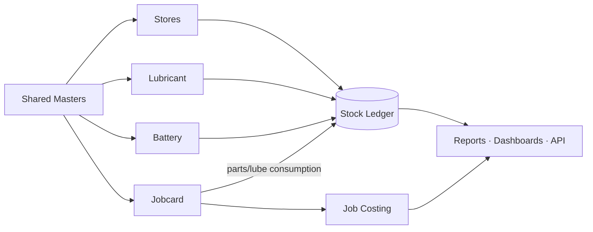
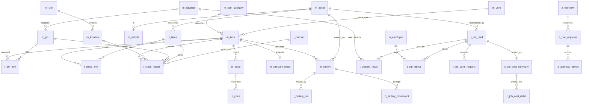

# Master Architecture & Data Model

> **Consolidated architecture + data-model reference** for the unified Master Management System (MMS)
> covering transport **Stores**, **Lubricant** stock, **Battery** tracking, and **Workshop Job Cards &
> Costing**. This document is self-contained but stays consistent with — and drills into —
> [00 Foundation](00-foundation-and-standards.md), [04 Masters](04-database-masters.md),
> [05 Transactions](05-database-transactions.md), and [06 Costing/History/Approval](06-database-costing-history-approval.md).

**Design contract (non-negotiable):**

| Rule | How it is honoured in the model |
|---|---|
| No duplicate records | One **golden record** per entity; unique business keys; shared masters (`m_*`); dedup at migration |
| Shared masters across modules | `m_item` (all materials incl. lube/battery), `m_asset` (vehicle/machine/equipment), one supplier/location/employee list |
| Effective-date pricing | `m_price` + `h_price` with `effective_from/effective_to`; cost resolved *as of* transaction date |
| Item stock by location | `l_stock_ledger` keyed by `item_id × location_id`; balances roll up the location hierarchy |
| Serial-controlled batteries | `m_battery` (one row per serial) + append-only `h_battery_movement` lineage |
| Excel-migration-friendly | Business codes on every master; flat `stg_*` staging + `map_*` cross-reference layer |
| Audit & traceability | Standard audit columns on every table + universal `h_audit_log`; `source_doc_*` on every ledger/cost row |
| Future API/ERP scalable | Surrogate keys, clean layering, idempotent postings, SAP object mapping |

---

## 1. Business architecture

The MMS replaces four disconnected books and their Excel spreadsheets with **one platform built on
four data layers** that every module shares.

```mermaid
flowchart TB
  subgraph L1[Layer 1 · Master Data]
    ITEM[m_item + categories + uom]:::m
    ASSET[m_asset · vehicle/machine/equip]:::m
    PARTY[m_supplier · m_employee]:::m
    LOC[m_site · m_location · m_department · m_project]:::m
    PRICE[m_price / h_price]:::m
  end
  subgraph L2[Layer 2 · Transactions]
    STORES[MRN · PO · GRN · Issue · Transfer · Adjust]:::t
    LUBE[Lubricant Issue]:::t
    BATT[Battery Txn]:::t
    JOB[Job Card · Labour · Parts · Outside Repair]:::t
  end
  subgraph L3[Layer 3 · Ledger & Movement]
    LED[(l_stock_ledger)]:::l
    BAL[l_stock_balance_month]:::l
  end
  subgraph L4[Layer 4 · Costing · Approval · Audit]
    COST[c_job_cost_summary / detail]:::c
    APPR[a_workflow / a_doc_approval]:::a
    AUD[h_audit_log · h_price · h_battery_*]:::a
  end

  L1 --> L2
  STORES & LUBE & BATT & JOB --> LED --> BAL
  JOB --> COST
  L2 --> APPR
  LED & L2 --> AUD
  LED & COST --> ANALYTICS[Dashboards · Reports · API]

  classDef m fill:#0e3a5f,color:#fff; classDef t fill:#12694a,color:#fff;
  classDef l fill:#6b4a12,color:#fff; classDef c fill:#5a2a6b,color:#fff; classDef a fill:#334155,color:#fff;
```

**Layering discipline** (ERP-style separation the user asked for):

| Layer | Table family | Rule |
|---|---|---|
| **Master** | `m_*` | Reference data; slowly changing; owned by a steward; never carries running balances |
| **Transaction** | `t_*` (header + `_line`) | Business events; reference masters; drive the ledger |
| **Ledger / movement** | `l_*` | Immutable append-only movement facts; the single source of stock truth |
| **History** | `h_*` | Append-only trails (price, battery lineage, audit) |
| **Approval** | `a_*` | Data-driven workflow state and actions |
| **Costing** | `c_*` | Derived cost, assembled from postings |

Masters never store stock; transactions never hold "current balance"; the **ledger** is the only place a
quantity or value accumulates. This separation is what makes the system auditable and API-safe.

---

## 2. Module map

| Module | Submodules | Masters consumed | Writes |
|---|---|---|---|
| **A · Stores / Material Mgmt** | MRN · Local Purchase (LPO) · Head-Office Purchase (HPR) · GRN/Receiving · Pricing · General Issues · Transfers · Adjustments · Stock Balance · Movement History | item, uom, supplier, location, price, department | `t_mrn`,`t_purchase_order`,`t_grn`,`t_issue`,`t_transfer`,`t_stock_adjustment` → `l_stock_ledger` |
| **B · Lubricant Stock Book** | Products · Issues · Asset-wise Consumption · Monthly Balance · Reorder/Forecast · Price History | item(LUBRICANT), asset, site, project, price | `t_issue(LUBRICANT)` → `l_stock_ledger`,`l_stock_balance_month` |
| **C · Battery Stock Book** | Register(serial) · Punch/Issue · Transfer · Return/Replace/Scrap · Warranty/Repair · Lifecycle | item(BATTERY_STOCK), battery, brand, asset, supplier | `t_battery_txn` → `h_battery_movement`,`h_battery_lifecycle`,`l_stock_ledger` |
| **D · Jobcard / Workshop** | Job Card · Approvals · Routing · Progress · Parts Requests · Labour · Outside Repair · Costing · Closure | asset, employee+rate, item, supplier | `t_job_card`(+children) → `c_job_cost_*`, links to `t_issue`,`t_grn` |
| **Shared** | Masters · Stock Ledger · Approval Engine · Audit · Analytics · Migration | — | `m_*`,`l_*`,`a_*`,`h_*`,`stg_*`,`map_*` |



---

## 3. Master data hierarchy

```
Organisation
└─ Site (m_site)                                   e.g. Head Office · Central Store · Estate-A
   ├─ Location (m_location · STORE / WORKSHOP)      stock-holding node
   │   └─ Location (BIN)                            lowest level; stock lives here
   │   └─ Location (IN_TRANSIT)                     virtual node for in-flight transfers
   ├─ Department / Cost Center (m_department)
   └─ Project (m_project)

Item (m_item)  ── one master for ALL materials ──
└─ Item Category (m_item_category · self-nesting)
    ├─ SPARE
    ├─ LUBRICANT        → m_lubricant_detail  (grade · viscosity · pack)
    ├─ BATTERY_STOCK    → m_battery           (one row per serial)
    ├─ GENERAL / CONSUMABLE
    └─ TYRE · FILTER · …
   ├─ Unit of Measure (m_uom) → m_uom_conversion   (BOX↔EA, DRUM↔L)
   └─ Price (m_price · effective-dated) → h_price

Asset (m_asset)  ── the maintainable object; one key for costing/lube/battery ──
├─ VEHICLE          (m_vehicle)     reg_no · make · odometer
├─ MACHINE          (m_machine)     capacity · hours_meter
└─ WORKSHOP_EQUIP   (m_workshop_asset)

Party
├─ Supplier (m_supplier)   type: LOCAL · HEAD_OFFICE · SUBCONTRACTOR   · Brand (m_brand)
└─ Employee (m_employee)   → Technician → Rate (m_technician_rate · effective-dated)

Security & Approval
├─ User (m_user) → Role (m_role) → Permission (m_permission)
└─ Approval Role (m_approval_role) → Workflow steps (a_workflow_step)
```

**Why this hierarchy avoids duplicates:** lubricants and batteries are **item categories**, not
separate item lists, so one part number = one valuation = one movement history. Vehicles, machines and
workshop equipment share **one `asset_id`**, so "job cost by vehicle", "lube by machine" and "battery on
asset" all point at the same object. Location nests **Site → Store → Bin**, so stock is held once at the
lowest node and rolls up cleanly.

---

## 4. Relational database schema

### 4.1 Consolidated ERD (cross-layer)



### 4.2 Naming conventions

- Tables `lower_snake_case`, prefixed by layer: `m_` `t_` (`_line`) `l_` `h_` `a_` `c_` · `ref_` lookup ·
  `stg_` staging · `map_` mapping · `v_` view.
- PK = surrogate `bigint generated always as identity`, named `<entity>_id`.
- Business key = `<entity>_code` (`UNIQUE`, indexed, user-facing).
- FK column reuses the referenced PK name (`item_id`, `asset_id`, `location_id`).
- Money/qty `numeric(18,4)`; rates/factors `numeric(18,6)`; codes `varchar`; enums as `varchar` validated
  against `ref_*`.
- **Standard audit columns on every table:** `created_by · created_at · updated_by · updated_at ·
  is_active` (soft delete; approvable docs add `approved_by · approved_at · status_code`).

---

## 5. Table list — keys & major fields

> Full column specs live in [04](04-database-masters.md)/[05](05-database-transactions.md)/[06](06-database-costing-history-approval.md);
> this is the consolidated single-page reference. **Audit columns are implied on every table.**

### 5.1 Master tables (`m_*`)

| Table | PK | Key FKs | Major fields |
|---|---|---|---|
| `m_item` | item_id | item_category_id, stock_uom_id | item_code*, description, item_type, is_serialized, valuation_method, reorder_level, min/max_qty, barcode |
| `m_item_category` | item_category_id | parent_category_id, gl_inventory_account_id | category_code*, name, valuation_default |
| `m_lubricant_detail` | item_id (=FK) | — | grade, viscosity, base_type, pack_size, api_spec |
| `m_uom` | uom_id | — | uom_code*, name, decimal_precision |
| `m_uom_conversion` | uom_conversion_id | from_uom_id, to_uom_id | factor |
| `m_supplier` | supplier_id | gl_payable_account_id | supplier_code*, name, supplier_type, tax_id, payment_terms |
| `m_brand` | brand_id | — | brand_code*, name |
| `m_asset` | asset_id | site_id, department_id | asset_code*, name, asset_type, status, commissioned_date |
| `m_vehicle` | asset_id (=FK) | — | reg_no*, make, model, year, chassis_no, engine_no, fuel_type, odometer |
| `m_machine` | asset_id (=FK) | — | capacity, hours_meter |
| `m_workshop_asset` | asset_id (=FK) | — | equip_type, bay_no |
| `m_battery` | battery_id | item_id, brand_id, supplier_id, original_asset_id, current_asset_id, grn_id | serial_no*, battery_type, size, voltage, ah_capacity, warranty_months, purchase_price, manufacture_date, warranty_expiry, current_status, image_url |
| `m_employee` | employee_id | department_id, site_id | employee_code*, full_name, is_technician, default_hourly_rate |
| `m_technician_rate` | rate_id | employee_id | hourly_rate, effective_from, effective_to |
| `m_site` | site_id | — | site_code*, name, region |
| `m_location` | location_id | site_id, parent_location_id | location_code*, name, location_type |
| `m_department` | department_id | site_id | dept_code*, name, cost_center_code |
| `m_project` | project_id | site_id | project_code*, name, status |
| `m_price` | price_id | item_id, supplier_id | price_type, unit_price, currency, effective_from, effective_to, source_doc_type/id |
| `m_gl_account` | gl_account_id | — | account_code*, name, account_type |
| `m_user` | user_id | employee_id | username*, password_hash, is_locked |
| `m_role` / `m_permission` | role_id / permission_id | — | role_code* / permission_code* |
| `m_approval_role` | approval_role_id | — | role_code*, approval_level |

`*` = unique business key.

### 5.2 Transaction tables (`t_*`)

| Table | PK | Key FKs | Major fields |
|---|---|---|---|
| `t_mrn` / `t_mrn_line` | mrn_id / mrn_line_id | site_id, department_id, requested_by / item_id, uom_id | mrn_no*, mrn_date, purpose, status_code / qty_requested, qty_issued |
| `t_purchase_order` / `t_po_line` | po_id / po_line_id | supplier_id, site_id, mrn_id / item_id, uom_id | po_no*, po_type(LOCAL/HEAD_OFFICE), po_date, total_value, status_code / qty, unit_price, expected_date, qty_received |
| `t_grn` / `t_grn_line` | grn_id / grn_line_id | supplier_id, po_id, job_card_id, location_id / item_id, uom_id | grn_no*, grn_date, invoice_no, price_received_date, is_priced, status_code / qty_received, unit_cost, batch_no, expiry_date |
| `t_issue` / `t_issue_line` | issue_id / issue_line_id | location_id, job_card_id, asset_id, project_id, department_id / item_id, uom_id | issue_no*, issue_type(GENERAL/JOB/LUBRICANT), issue_date, odometer, machine_hours, override_flag, override_by, status_code / qty, unit_cost |
| `t_transfer` / `t_transfer_line` | transfer_id / transfer_line_id | from_location_id, to_location_id / item_id, uom_id | transfer_no*, transfer_date, status_code / qty, unit_cost |
| `t_stock_adjustment` / `_line` | adjustment_id / line_id | location_id, approved_by / item_id | adj_no*, adj_date, reason_code, status_code / system_qty, counted_qty, variance_qty, unit_cost |
| `t_battery_txn` | battery_txn_id | battery_id, from_asset_id, to_asset_id, job_card_id, supplier_id | txn_no*, txn_type(PUNCH/ISSUE/TRANSFER/RETURN/REPLACEMENT/SCRAP/WARRANTY/REPAIR), txn_date, odometer, reason, status_code |
| `t_job_card` | job_card_id | asset_id, site_id, department_id, transport_officer_id, workshop_supervisor_id | jc_no*, jc_date, complaint, priority, tm_approved_by/at, om_approved_by/at, planned/actual_start/end, estimated_cost, closed_by/at, status_code |
| `t_job_task` | task_id | job_card_id, assigned_to | description, status |
| `t_job_progress` | progress_id | job_card_id, entered_by | log_date, work_done, hours |
| `t_job_parts_request` | request_id | job_card_id, item_id, issue_id, grn_id | qty_requested, request_type(INTERNAL/EXTERNAL), source(STOCK/PURCHASE), status_code |
| `t_job_labour` | labour_id | job_card_id, employee_id | work_date, hours, hourly_rate, line_cost, remarks |
| `t_outside_repair` | outside_repair_id | job_card_id, supplier_id, grn_id | or_no*, description, sent_date, expected_date, received_date, quoted_cost, actual_cost, status_code |

### 5.3 Ledger / movement tables (`l_*`)

| Table | PK | Key FKs | Major fields |
|---|---|---|---|
| `l_stock_ledger` | ledger_id | item_id, location_id, reversal_of_ledger_id | movement_type, qty_in, qty_out, unit_cost, movement_value, **running_balance_qty**, running_balance_value, source_doc_type, source_doc_id, source_doc_no, txn_date, posted_at, batch_no, reversed_flag |
| `l_stock_balance_month` | balance_id | item_id, location_id | period_year, period_month, opening_qty/value, receipts_qty, issues_qty, closing_qty/value, avg_unit_cost, is_closed |

### 5.4 History tables (`h_*`)

| Table | PK | Key FKs | Major fields |
|---|---|---|---|
| `h_battery_movement` | history_id | battery_id, battery_txn_id, from_asset_id, to_asset_id, done_by | event_type, event_date, odometer, notes |
| `h_battery_lifecycle` | lifecycle_id | battery_id | event_type, status_from, status_to, event_date, warranty_flag, cost, notes |
| `h_price` | price_history_id | item_id | price_type, unit_price, effective_from, effective_to, source_doc_type/id |
| `h_audit_log` | audit_id | changed_by | table_name, record_id, action, changed_at, old_values(jsonb), new_values(jsonb), source_doc_no |

### 5.5 Approval tables (`a_*`)

| Table | PK | Key FKs | Major fields |
|---|---|---|---|
| `a_workflow` | workflow_id | — | workflow_code*, doc_type, is_active |
| `a_workflow_step` | step_id | workflow_id, approval_role_id | step_no, min_value, max_value, sla_hours, is_mandatory |
| `a_doc_approval` | doc_approval_id | workflow_id, requested_by | doc_type, doc_id, current_step_no, status |
| `a_approval_action` | action_id | doc_approval_id, acted_by | step_no, action(APPROVE/REJECT/RETURN), acted_at, comments |

### 5.6 Costing tables (`c_*`)

| Table | PK | Key FKs | Major fields |
|---|---|---|---|
| `c_job_cost_summary` | cost_summary_id | job_card_id (unique) | labour/material/general/outside_cost, total_cost, estimated_cost, variance_amount, variance_pct, has_provisional, is_final, computed_at |
| `c_job_cost_detail` | cost_detail_id | job_card_id, item_id | cost_element(LABOUR/MATERIAL/GENERAL/OUTSIDE), source_doc_type/id, qty, unit_cost, line_cost, price_source, effective_price_date, is_provisional |
| `c_pending_price` | pending_price_id | item_id | source_doc_type/id, qty, provisional_cost, reason, flagged_at, resolved_flag, resolved_at, resolved_price |
| `c_fifo_layer` | layer_id | item_id, location_id, grn_id | received_qty, remaining_qty, unit_cost, received_date |

### 5.7 Migration tables (`stg_*` / `map_*`)

| Table | Purpose | Control columns |
|---|---|---|
| `stg_item`, `stg_supplier`, `stg_asset`, `stg_location`, `stg_price`, `stg_opening_stock`, `stg_battery`, `stg_battery_history`, `stg_open_jobcard` | Raw Excel/backup load per source object | load_batch_id, source_file, source_row, row_status, error_msg, loaded_id |
| `map_item_code`, `map_supplier_code`, `map_asset_code`, `map_location_code`, `map_uom` | Old-code → new-`id` cross-reference & dedup anchor | old_code, new_id, survivor_flag |

---

## 6. Status design

All statuses `UPPER_SNAKE`, defined once in `ref_status(doc_type, status_code, sort_order, is_terminal,
ui_color)` and reused across grids, chips, workflows and reports.

| Process | Status lifecycle |
|---|---|
| MRN | `DRAFT → SUBMITTED → APPROVED → PARTIALLY_ISSUED → ISSUED → CLOSED` · `CANCELLED` |
| Purchase (LPO/HPR) | `DRAFT → SUBMITTED → APPROVED → ORDERED → PARTIALLY_RECEIVED → RECEIVED → CLOSED` · `CANCELLED` |
| GRN | `DRAFT → RECEIVED → PENDING_PRICING → PRICED → POSTED` · `CANCELLED` |
| Transfer | `DRAFT → SUBMITTED → IN_TRANSIT → RECEIVED → POSTED` · `CANCELLED` |
| Issue | `DRAFT → ISSUED → POSTED` · `OVERRIDE_ISSUED` · `CANCELLED` |
| Adjustment | `DRAFT → SUBMITTED → APPROVED → POSTED` · `REJECTED` |
| Battery Txn | `DRAFT → CONFIRMED → POSTED` · `CANCELLED` |
| Job Card | `DRAFT → SUBMITTED → TM_APPROVED → OM_APPROVED → ROUTED_TO_WORKSHOP → IN_PROGRESS → WORK_COMPLETED → PENDING_COSTING → COSTED → CLOSED` · flags `ON_HOLD` / `DELAYED` · `CANCELLED` |
| Outside Repair | `REQUESTED → APPROVED → SENT → IN_PROGRESS → RECEIVED → INVOICED → COSTED → CLOSED` |
| Parts Request | `REQUESTED → APPROVED → SOURCING → ISSUED/PURCHASED → RECEIVED → CLOSED` · `REJECTED` |
| Approval (generic) | `PENDING → APPROVED` · `REJECTED` · `RETURNED` |

**Rules:** status transitions are validated by the service layer (no illegal jumps); terminal statuses
(`CLOSED`/`CANCELLED`/`POSTED`) freeze the record except by an audited reversal; `DELAYED`/`ON_HOLD` are
**flags layered on** the Job Card flow, not replacements for it.

---

## 7. Numbering format recommendation

Generated centrally by `fn_next_docno(doc_type, site)` — **gap-free, concurrency-safe, reset yearly per
doc-type per site**. Masks: `{SITE}` site code · `{YY}` 2-digit year · `{NNNNN}` zero-padded serial.

| Doc | Mask | Example |
|---|---|---|
| MRN | `MRN-{SITE}-{YY}-{NNNNN}` | `MRN-HO-26-00042` |
| Local Purchase Order | `LPO-{SITE}-{YY}-{NNNNN}` | `LPO-CS-26-00301` |
| Head-Office Purchase Req | `HPR-{YY}-{NNNNN}` | `HPR-26-00088` |
| Goods Receipt Note | `GRN-{SITE}-{YY}-{NNNNN}` | `GRN-CS-26-01187` |
| Material Transfer | `TRF-{FROM}-{YY}-{NNNNN}` | `TRF-CS-26-00210` |
| General Issue | `ISS-{SITE}-{YY}-{NNNNN}` | `ISS-WS-26-00733` |
| Lubricant Issue | `LUB-{SITE}-{YY}-{NNNNN}` | `LUB-WS-26-00925` |
| Battery Txn | `BAT-{YY}-{NNNNN}` | `BAT-26-00377` |
| Job Card | `JC-{SITE}-{YY}-{NNNNN}` | `JC-WS-26-00514` |
| Outside Repair | `OR-{YY}-{NNNNN}` | `OR-26-00061` |
| Parts Request | `PR-{JCSEQ}-{NN}` | `PR-JCWS2600514-02` |
| Stock Adjustment | `ADJ-{SITE}-{YY}-{NNNNN}` | `ADJ-CS-26-00045` |

**Master codes** (business keys) use short readable prefixes: item `IT-######`, supplier `SUP-#####`,
asset by fleet number (`CAB-1123`, `EXC-21`), location `CS-A-01` (site-zone-bin), battery = physical
`serial_no`. Codes are immutable once transacted against.

---

## 8. Data governance rules

Governance is what keeps "one master, no duplicates" true over time.

### 8.1 Ownership & stewardship
| Master | Data steward (owner) | Who may create/approve |
|---|---|---|
| Item, Category, UoM | Inventory Controller | steward creates; new items reviewed before first transaction |
| Supplier, Brand | Procurement / Finance | steward creates; duplicate check on tax_id/name |
| Asset (vehicle/machine) | Transport / Fleet | steward creates; asset_code immutable |
| Employee, Rate | HR / Workshop | HR creates; rates effective-dated |
| Price | Pricing Officer | only role that may set `m_price`; recorded in `h_price` |
| Location, Department, Project | System Administrator | controlled setup data |

### 8.2 Golden-record & de-duplication rules
- **One entity, one row.** Unique constraints on every business key (`item_code`, `serial_no`, `reg_no`,
  supplier `tax_id`, `location_code`).
- **Create-time duplicate guard:** fuzzy match on name/code before a new master is saved; near-matches
  must be confirmed or merged.
- **Merge, don't delete:** duplicate masters are merged to a survivor; the loser is deactivated
  (`is_active=false`) and remapped via `map_*`, preserving historic references.
- **No free-text where a master exists:** transactions must reference `item_id`/`supplier_id`/`asset_id`,
  never a typed name.

### 8.3 Mandatory-field & data-quality rules
- Every master requires: business code, name/description, category/type, owning steward, `is_active`.
- Item requires stock UoM + category + valuation method; battery requires serial + warranty base.
- DQ checks run on save and nightly: orphan FKs, blank mandatory fields, invalid UoM, negative
  reorder/min/max, price outliers, batteries `IN_SERVICE` without a `current_asset_id`.

### 8.4 Effective-dating governance
- Prices and technician rates are **never overwritten** — a new effective row is added and the prior
  range is closed (`effective_to = new.effective_from − 1`); history is `h_price`.
- Effective ranges per (item, price_type, supplier) must be **continuous and non-overlapping** (enforced
  by constraint/trigger); costing always resolves the row where `txn_date ∈ [from, to)`.

### 8.5 Change control & reference data
- Master changes are captured in `h_audit_log` (old→new); code fields are immutable once transacted.
- Enumerations live in `ref_*` and are changed only by admin through configuration — never hard-coded.
- Reactivating a deactivated master requires steward approval.

### 8.6 Audit, retention & access
- Standard audit columns on every table + `h_audit_log` for full change trails (who/what/when).
- Ledger, history and audit tables are **append-only** (reverse-not-delete); retained per policy
  (recommend ≥ 7 years for financial/stock records).
- Master maintenance and reversals are permissioned (RBAC) with segregation of duties (e.g. receiver ≠
  pricer; creator ≠ approver).

### 8.7 Migration governance
- Nothing enters live tables until it passes staging validation and reconciliation
  ([11 Migration](11-data-migration-strategy.md)); every loaded row keeps `loaded_id` lineage back to its
  Excel origin; loads are batch-reversible.

---

## 9. Risks & controls (data-model focus)

| # | Risk | Impact | Control |
|---|---|---|---|
| 1 | Duplicate masters carried from Excel | Split stock/spend, wrong costing | Golden-record + unique keys + `map_*` dedup + create-time guard |
| 2 | Free-text item/supplier on transactions | Un-reportable data | FK-only references; no name fields on `t_*` lines |
| 3 | Stock value editable outside the ledger | Untrustworthy balances | Balance is **derived** from `l_stock_ledger`; no editable on-hand field |
| 4 | Negative / silent stock | Phantom availability | No-negative rule; authorized `OVERRIDE_ISSUED` only + alert |
| 5 | Wrong cost from price-date errors | Costing/valuation error | Effective-date resolution + continuous non-overlapping ranges + `price_source` audit |
| 6 | Battery serial lineage broken on transfer | Warranty/asset loss | Append-only `h_battery_movement`; integrity check IN_SERVICE⇒has asset |
| 7 | Master edited without trail | Audit gap | `h_audit_log` old/new + immutable codes + RBAC |
| 8 | Approval bypass / self-approval | Control failure | Data-driven engine; creator ≠ approver; two distinct job approvers |
| 9 | Opening balances don't reconcile | Wrong day-1 stock | `OPENING` ledger entries + zero-variance reconciliation gate |
| 10 | Concurrency double-posting | Ledger corruption | Row lock on balance + idempotency keys on posting APIs |
| 11 | Reference/status drift between modules | Inconsistent behaviour | Central `ref_*`; single status registry; no hard-coded enums |
| 12 | Scope growth breaks the model | Delivery/tech debt | Clean layering + surrogate keys + SAP object mapping keep it extensible |

---

### Cross-references
Deeper detail: [00 Foundation](00-foundation-and-standards.md) · [04 Masters](04-database-masters.md) ·
[05 Transactions & Ledger](05-database-transactions.md) ·
[06 Costing/History/Approval](06-database-costing-history-approval.md) ·
[10 Roles & Permissions](10-user-roles-and-permissions.md) ·
[11 Migration](11-data-migration-strategy.md) · [16 Risks & Controls](16-risks-and-controls.md).
