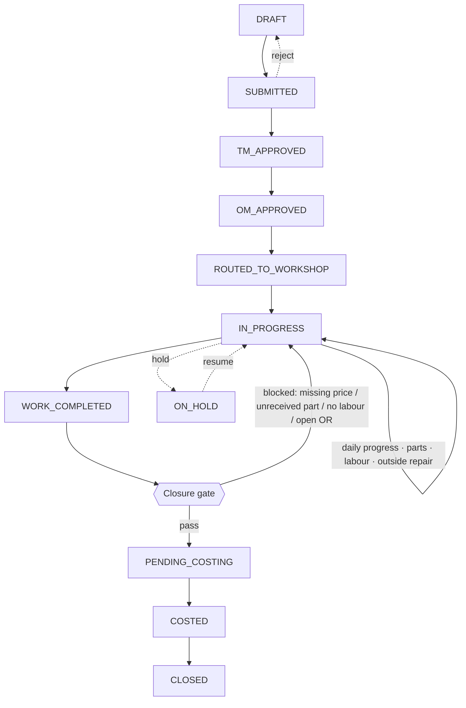
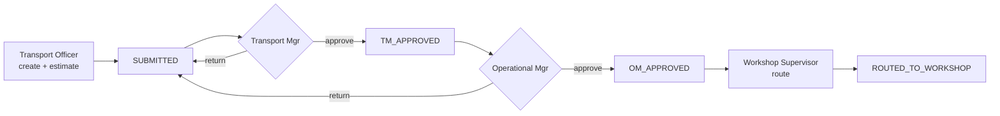
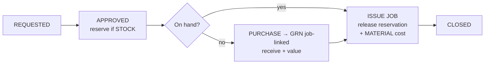
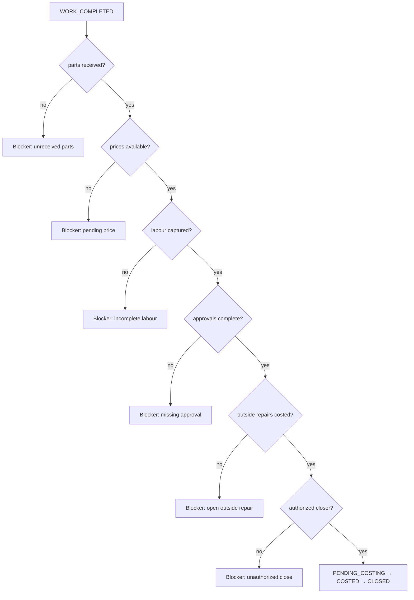

# Process Design — Job Card Lifecycle & Costing Model

> Full workshop job-card lifecycle and maintenance costing model, built on
> [Phase 1 Architecture](master-architecture-and-data-model.md) and
> [Phase 2 Process Design](process-design-stores-lubricant-battery.md). Reuses the tables, statuses and
> numbering from [00 Foundation](00-foundation-and-standards.md); expands [05](05-database-transactions.md),
> [06](06-database-costing-history-approval.md), [07](07-workflow-design.md) and [08](08-costing-logic.md).

## 0. Lifecycle at a glance

```
TRANSPORT                 MANAGEMENT                 WORKSHOP                       FINANCE
─────────                 ──────────                 ────────                       ───────
Create JC ─► Submit ─► TM approve ─► OM approve ─► Route ─► Start ─► [Progress /     ─► Cost review
                                                    Parts / Labour /                    ─► Close
                                                    Outside repair] ─► Work done ─►
                                                    Closure gate ─────────────────►
```

**Status flow (`t_job_card.status_code`):**
`DRAFT → SUBMITTED → TM_APPROVED → OM_APPROVED → ROUTED_TO_WORKSHOP → IN_PROGRESS → WORK_COMPLETED →
PENDING_COSTING → COSTED → CLOSED` · flags `ON_HOLD` / `DELAYED` · `CANCELLED`



---

## 1. Job card header & line-item structure

### 1.1 Header — `t_job_card`
| Field | Type | Notes |
|---|---|---|
| job_card_id | bigint PK | |
| jc_no | varchar UQ | `JC-{SITE}-{YY}-{NNNNN}` |
| jc_date | date | raised date |
| asset_id | FK→m_asset | the vehicle/machine |
| odometer_in / hours_in | numeric | reading at intake |
| complaint | varchar(500) | reported fault |
| job_type | varchar | `BREAKDOWN`/`SCHEDULED`/`ACCIDENT`/`INSPECTION` |
| priority | varchar | `LOW`/`MED`/`HIGH`/`CRITICAL` |
| site_id / department_id | FK | attribution |
| reported_by / transport_officer_id | FK→m_employee | origin |
| tm_approved_by / tm_approved_at | FK / ts | Level-1 |
| om_approved_by / om_approved_at | FK / ts | Level-2 |
| workshop_supervisor_id / bay_no | FK / varchar | routing |
| planned_start / planned_end | date | schedule (drives `DELAYED`) |
| actual_start / actual_end | date | reality |
| estimated_cost | numeric(18,4) | from estimate lines |
| actual_cost | numeric(18,4) | from `c_job_cost_summary` |
| closed_by / closed_at | FK / ts | closure |
| status_code | varchar | lifecycle |

### 1.2 Line-item families (children of the job card)
| Family | Table | Purpose |
|---|---|---|
| **Estimate lines** | `t_job_estimate_line` | Pre-approval cost estimate by element (drives `estimated_cost`) |
| **Task lines** | `t_job_task` | Work breakdown; assignable; status-tracked |
| **Parts / material lines** | `t_job_parts_request` → fulfilled by `t_issue`/`t_grn` | Parts needed, sourced, received, costed |
| **Labour lines** | `t_job_labour` | Technician hours × rate |
| **Outside repair lines** | `t_outside_repair` | Subcontract work |
| **General item lines** | `t_issue(GENERAL, job_card_id)` | Shop consumables charged to the job |
| **Cost lines (derived)** | `c_job_cost_detail` | One row per real posting, by cost element |

**`t_job_estimate_line`** — `estimate_line_id` PK, `job_card_id` FK, `cost_element`
(`LABOUR`/`MATERIAL`/`GENERAL`/`OUTSIDE`), `description`, `estimated_qty`, `estimated_unit_cost`,
`estimated_amount`. Sum → `t_job_card.estimated_cost`, enabling **line-level** estimated-vs-actual.

---

## 2. Approval workflow (transport → management → workshop)

Driven by the `JC_APPROVAL` workflow in `a_workflow`/`a_workflow_step` (two mandatory steps).

| Step | Actor | Action | Effect | Resulting status |
|---|---|---|---|---|
| 1 | transport_officer | Create + submit JC (with estimate) | `a_doc_approval` opened | `DRAFT → SUBMITTED` |
| 2 | transport_manager | Approve L1 / Return | `tm_approved_*`; `a_approval_action(APPROVE)` | `TM_APPROVED` / back to `DRAFT` |
| 3 | operational_manager | Approve L2 / Return | `om_approved_*` | `OM_APPROVED` / back to `SUBMITTED` |
| 4 | workshop_supervisor | Accept & route to bay/technician | supervisor+bay set | `ROUTED_TO_WORKSHOP` |



**Controls:** creator ≠ approver; the two approvers must be **different** users (SoD); high-value or
`ACCIDENT` jobs can require an extra finance step via a value-banded `a_workflow_step`; approval SLA
breach auto-escalates and alerts.

---

## 3. Workshop execution workflow

| # | Actor | Action | Effect | Status |
|---|---|---|---|---|
| 1 | workshop_supervisor | Assign technician(s), open tasks | `t_job_task` rows | `ROUTED_TO_WORKSHOP` |
| 2 | technician | Start job | `actual_start` set | `IN_PROGRESS` |
| 3 | technician | Log daily work-done | `t_job_progress` rows | (in progress) |
| 4 | supervisor/technician | Request parts (internal/external) | `t_job_parts_request` (§4) | (in progress) |
| 5 | store_keeper | Issue/receive parts to job | `t_issue(JOB)`/`t_grn(job_card_id)` → cost lines | (in progress) |
| 6 | technician | Record labour hours | `t_job_labour` (§6) | (in progress) |
| 7 | supervisor | Send/receive outside repair | `t_outside_repair` (§5) | (in progress) |
| 8 | supervisor | Mark work complete | `actual_end` set | `WORK_COMPLETED` |
| 9 | system | Run closure gate (§8) | validate | `PENDING_COSTING` / stay |
| 10 | finance_reviewer | Review cost vs estimate; close | `c_job_cost_summary`; `closed_*` | `COSTED → CLOSED` |

**On-hold:** supervisor may set `ON_HOLD` (awaiting part/decision) with a reason; excluded from active
utilization but still ages. Resume returns to `IN_PROGRESS`.

---

## 4. Daily progress log & material request/reservation

### 4.1 Daily progress log — `t_job_progress`
| Field | Notes |
|---|---|
| progress_id PK · job_card_id FK | |
| log_date | one or more entries per day |
| work_done | free text of the day's work |
| task_id | optional link to `t_job_task` |
| hours | informational hours (labour cost is `t_job_labour`) |
| pct_complete | supervisor's completion estimate |
| entered_by | technician/supervisor |

Progress entries build the **job timeline** (UI) and feed turnaround/aging analytics.

### 4.2 Material request & reservation — `t_job_parts_request`
| Field | Notes |
|---|---|
| request_id PK · job_card_id FK · item_id FK | |
| qty_requested / qty_reserved / qty_issued | |
| request_type | `INTERNAL` (from stock) / `EXTERNAL` (buy) |
| source | `STOCK` / `PURCHASE` |
| issue_id / grn_id | fulfilment links |
| status_code | Parts-Request flow |

**Reservation model (soft-commit stock):** when a `STOCK` request is approved, the requested qty is
**reserved** — committed but not yet physically issued — so other jobs see true availability.

```
available_qty(item, location) = running_balance_qty − reserved_qty
reserved_qty(item, location)  = Σ (qty_requested − qty_issued)
                                over t_job_parts_request
                                where source = STOCK
                                  and status_code in (APPROVED, SOURCING)
```

Reservation does **not** post to `l_stock_ledger` (no stock has moved); it only nets availability.
Physical `ISSUE` posting happens at fulfilment and releases the reservation.

**Parts-Request flow:** `REQUESTED → APPROVED → SOURCING → ISSUED`/`PURCHASED → RECEIVED → CLOSED` · `REJECTED`



**Validation:** item active; qty > 0; availability nets reservations; `EXTERNAL` requests must reference
an approved LPO/HPR before purchase.

---

## 5. Outside / subcontract repair process

**Doc:** `t_outside_repair` · **No:** `OR-{YY}-{NNNNN}`
**Flow:** `REQUESTED → APPROVED → SENT → IN_PROGRESS → RECEIVED → INVOICED → COSTED → CLOSED`

| # | Actor | Action | Effect | Status |
|---|---|---|---|---|
| 1 | workshop_supervisor | Raise OR on the job (subcontractor, quoted_cost) | `t_outside_repair` | `REQUESTED` |
| 2 | operational_manager | Approve send-out (value band) | action | `APPROVED` |
| 3 | supervisor | Dispatch assembly | `sent_date` | `SENT` |
| 4 | subcontractor | Perform work | — | `IN_PROGRESS` |
| 5 | receiving_clerk | Receive back + invoice | `t_grn(job_card_id)` linked to OR | `RECEIVED → INVOICED` |
| 6 | pricing_officer | Price the invoice | `actual_cost`; `c_job_cost_detail(OUTSIDE)` | `COSTED` |

**Controls:** an OR that is not `COSTED` blocks job closure; quoted vs actual variance surfaced;
overdue return (past `expected_date`) alerts the supervisor.

---

## 6. Labour capture model — `t_job_labour`

| Field | Notes |
|---|---|
| labour_id PK · job_card_id FK · employee_id FK | technician (`is_technician=true`) |
| work_date | drives rate resolution |
| hours | numeric(18,4) |
| hourly_rate | resolved from `m_technician_rate` effective on `work_date` (else `m_employee.default_hourly_rate`) |
| line_cost | `hours × hourly_rate` |
| task_id | optional link |
| remarks | |

**Rules:** rate is **system-resolved** (not typed) via effective-date; only `is_technician` employees may
be booked; hours > 0; work_date within `[actual_start, actual_end]`; duplicate technician/date/task lines
warned. Labour is captured **as work happens**, not reconstructed at close.

---

## 7. Cost formulas

Notation `Σ` = sum over the job's lines. Computed into `c_job_cost_detail` (line) and rolled to
`c_job_cost_summary` (job). All at `numeric(18,4)`; round the line, then sum.

```
labour_cost   = Σ ( hours × effective_hourly_rate(employee, work_date) )     -- t_job_labour
material_cost = Σ ( qty_issued × effective_unit_cost(item, issue_date) )     -- t_issue(JOB)
general_cost  = Σ ( qty × effective_unit_cost(item, issue_date) )            -- t_issue(GENERAL, job)
outside_cost  = Σ ( actual_cost )   over t_outside_repair where status = COSTED

total_cost    = labour_cost + material_cost + general_cost + outside_cost

variance_amount = total_cost − estimated_cost
variance_pct    = variance_amount / NULLIF(estimated_cost, 0) × 100
```

`effective_unit_cost` = WAC/FIFO ledger cost for stock issues, or effective `m_price` for
direct-to-job purchases (flagged `is_provisional` until priced). `effective_hourly_rate` = effective
technician rate on `work_date`.

**Mini worked example** (full sheet in [08 §8.5](08-costing-logic.md)):
labour Rs 8,100 + material Rs 45,990 + general Rs 730 + outside Rs 18,600 = **Rs 73,420** total;
estimate Rs 85,000 → variance **−Rs 11,580 (−13.6%)**, under budget.

**Estimated-vs-actual by element** (from `t_job_estimate_line` vs `c_job_cost_summary`):
| Element | Estimated | Actual | Variance |
|---|---|---|---|
| Labour | est_L | labour_cost | Δ |
| Material | est_M | material_cost | Δ |
| General | est_G | general_cost | Δ |
| Outside | est_O | outside_cost | Δ |
| **Total** | estimated_cost | total_cost | variance_amount / pct |

---

## 8. Job close validations (the closure gate)

A job reaches `COSTED → CLOSED` only when **all** conditions pass — `fn_can_close_job(job_card_id)`:

```
CLOSE ALLOWED  ⇔
    all t_job_parts_request are ISSUED / RECEIVED / written-off      -- no unreceived parts
AND no c_pending_price references this job                           -- all prices available
AND every t_grn feeding this job is POSTED                           -- GRN complete where needed
AND at least the required t_job_labour is captured (hours > 0)       -- labour complete
AND every t_outside_repair is COSTED (or none apply)                 -- outside repair valued
AND tm_approved_at IS NOT NULL AND om_approved_at IS NOT NULL        -- approvals complete
AND c_job_cost_summary.has_provisional = false                       -- no provisional cost
AND actor has permission 'jobcard.close' AND actor ≠ sole approver   -- authorized close
```

Any failed clause returns a **named blocker** the UI shows inline (not a generic error), and the job
stays in `PENDING_COSTING`/`WORK_COMPLETED`.



---

## 9. Open / delayed / completed monitoring logic

| Monitor | Definition |
|---|---|
| **Open jobs** | `status_code NOT IN (CLOSED, CANCELLED)` |
| **In progress** | `status_code = IN_PROGRESS` |
| **Pending (awaiting)** | `status_code IN (SUBMITTED, TM_APPROVED, OM_APPROVED, ROUTED_TO_WORKSHOP, WORK_COMPLETED, PENDING_COSTING)` |
| **Delayed** | open AND (`today > planned_end` OR (`actual_start IS NULL` AND `today > planned_start`)) → sets `DELAYED` flag |
| **Blocked** | `WORK_COMPLETED`/`PENDING_COSTING` AND closure gate fails |
| **Completed** | `status_code IN (COSTED, CLOSED)` |
| **Aging buckets** | days since `jc_date`: 0–3 / 4–7 / 8–14 / 15+ |
| **WIP value** | `Σ c_job_cost_detail` for open jobs (cost incurred, not yet closed) |
| **Turnaround time** | `actual_end − actual_start` for completed jobs |
| **Labour utilization** | `Σ labour hours ÷ available technician hours` |

**Alerts:** approval > SLA; job `DELAYED`; job blocked at gate (with reason); OR overdue; job
`WORK_COMPLETED` but uncosted > N days.

---

## 10. Strong controls

| Control area | Enforcement |
|---|---|
| **Missing prices** | Consumed unpriced items post provisional cost + queue `c_pending_price`; `has_provisional=true` blocks close; missing-price alert to pricing_officer |
| **Unreceived parts** | Closure gate requires all parts `ISSUED/RECEIVED/written-off`; unfulfilled request alerts; PO past expected_date alerts |
| **Unauthorized close** | `jobcard.close` permission (finance_reviewer/supervisor); closer ≠ sole approver; all attempts audited in `h_audit_log` |
| **Missing approvals** | Cannot route/execute without `TM_APPROVED` + `OM_APPROVED`; gate re-checks both timestamps; two distinct approvers |
| **Incomplete labour capture** | Gate requires labour hours > 0; supervisor sign-off on labour before `COSTED`; "labour not signed" blocker |
| **Cost integrity** | Costs derive only from real postings; no manual cost entry on the summary; reversal-not-edit |
| **Reopen** | Closed job reopen = admin/finance only, audited with justification |

---

## 11. Suggested UI screens

| Screen | Purpose | Key fields / actions | Grid / panels |
|---|---|---|---|
| **Job Card Entry** | Raise & estimate | asset lookup, complaint, type, priority, odo; estimate lines by element; Submit | estimate: element · desc · qty · unit · amount |
| **Approval Queue** | TM/OM sign-off | my pending; value, age vs SLA; Approve/Return + comment | jc_no · vehicle · est cost · age |
| **Job Board (Kanban)** | Workshop overview | columns by status; drag to route; filters site/supervisor | cards: jc_no · vehicle · priority · blocker |
| **Job Card Detail** | Run the job | status chip, est-vs-actual gauge; tabs; action bar contextual to status | timeline (progress) · cost breakdown (L/M/G/O) · **closure-gate checklist** |
| **Daily Progress** | Log work-done | date, task, work_done, %complete; Add | progress feed |
| **Parts Request** | Request/reserve/issue | item lookup (shows available net of reservations), qty, internal/external; Request/Issue | item · requested · reserved · issued · status |
| **Labour Entry** | Capture hours | technician, date, hours (rate auto), task; Add | technician · date · hours · rate · cost |
| **Outside Repair** | Send-out tracking | subcontractor, description, quoted, sent/expected/received; Receive→GRN | or_no · supplier · quoted · actual · status |
| **Costing Sheet** | Review & close | element rollups, variance; **Close** (gate-guarded, shows blockers) | element · est · actual · variance |
| **Monitoring Dashboard** | Open/delayed/completed | counts, aging, WIP value, utilization, cost by vehicle | status donut · delayed list · blockers |

---

## 12. Consolidated status tables

| Object | Status flow |
|---|---|
| **Job Card** | `DRAFT → SUBMITTED → TM_APPROVED → OM_APPROVED → ROUTED_TO_WORKSHOP → IN_PROGRESS → WORK_COMPLETED → PENDING_COSTING → COSTED → CLOSED` · `ON_HOLD` · `DELAYED` · `CANCELLED` |
| **Job Task** | `OPEN → IN_PROGRESS → DONE` · `CANCELLED` |
| **Parts Request** | `REQUESTED → APPROVED → SOURCING → ISSUED`/`PURCHASED → RECEIVED → CLOSED` · `REJECTED` |
| **Outside Repair** | `REQUESTED → APPROVED → SENT → IN_PROGRESS → RECEIVED → INVOICED → COSTED → CLOSED` · `CANCELLED` |
| **Approval (generic)** | `PENDING → APPROVED` · `REJECTED` · `RETURNED` |
| **Cost summary** | `provisional → final (is_final=true at COSTED)` |
