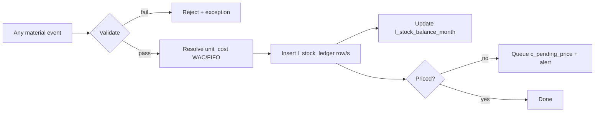
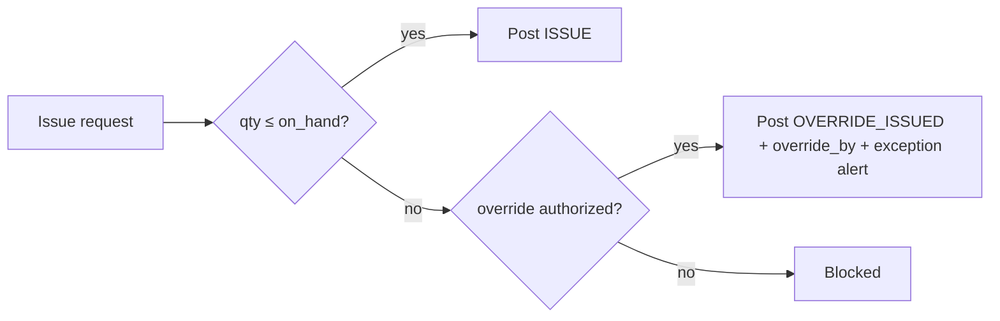
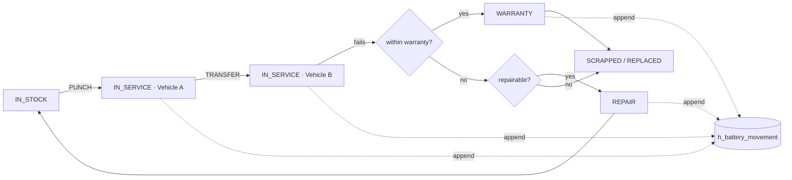

# Process Design — Stores, Lubricant & Battery

> Detailed transaction workflows, status maps, movement logic, validation, approvals, exception
> handling, **screen-level designs**, reports and alerts for the three material modules. Built on the
> [Master Architecture & Data Model](master-architecture-and-data-model.md); reuses the table names,
> status values and numbering from [00 Foundation](00-foundation-and-standards.md). Higher-level flows
> are in [07 Workflow Design](07-workflow-design.md).

## 0. Enforced business rules (traced to mechanism)

| Rule | Mechanism in this design |
|---|---|
| Every movement posts to a stock ledger | All receipt/issue/transfer/return/adjustment postings write `l_stock_ledger` (§1) |
| No issue without availability unless override authorized | Availability check → block, or `OVERRIDE_ISSUED` with `override_by` + alert (§3.5) |
| Transfers reduce source & increase destination | Paired `TRANSFER_OUT` + `TRANSFER_IN` via `IN_TRANSIT` (§1, §3.6) |
| Battery records preserve complete serial history | Append-only `h_battery_movement` + `h_battery_lifecycle` (§5) |
| Lubricant usage traceable by vehicle/machine/date | Mandatory `asset_id`/`site_id`/`project_id` + `issue_date` on `t_issue(LUBRICANT)` (§4) |
| Missing prices → pending valuation queue | Unpriced receipt/consumption queues `c_pending_price` (§2.4, §6) |

---

## 1. Stock movement engine — the posting logic

Every material event resolves to one or more `l_stock_ledger` rows. This matrix is the single source of
truth for how stock and value change.

| Event | movement_type | qty_in | qty_out | unit_cost basis | Balance effect | Paired? |
|---|---|---|---|---|---|---|
| Opening (migration) | `OPENING` | opening_qty | 0 | last known cost | seed balance | no |
| Goods receipt (GRN) | `RECEIPT` | qty_received | 0 | GRN priced cost (or provisional) | +qty, recompute WAC/FIFO | no |
| Issue (general/job/lube) | `ISSUE` | 0 | qty_issued | current WAC / FIFO layer | −qty | no |
| Transfer dispatch | `TRANSFER_OUT` | 0 | qty | source WAC | −qty at source (→ `IN_TRANSIT`) | **yes** |
| Transfer receipt | `TRANSFER_IN` | qty | 0 | **same** as OUT | +qty at destination | **yes** |
| Return to store | `RETURN` | qty | 0 | original issue cost | +qty | links to issue |
| Adjustment (count) | `ADJUSTMENT` | variance⁺ | variance⁻ | current WAC | ±variance | no |
| Reversal (correction) | opposite of original | mirror | mirror | original cost | undo | `reversal_of_ledger_id` |

**Posting is atomic** (one DB transaction): lock `(item_id, location_id)` → compute `unit_cost` →
insert ledger row with recomputed `running_balance_qty/value` → update `l_stock_balance_month` → if
unpriced, queue `c_pending_price`. **Corrections are reversals, never edits/deletes.**

---

## 2. STORES processes

### 2.1 MRN (Material Requisition Note)

**Purpose:** capture demand from a site/department; drives issue-from-stock or purchase.
**Doc:** `t_mrn`/`t_mrn_line` · **No:** `MRN-{SITE}-{YY}-{NNNNN}`

**Workflow**
| # | Actor | Action | System effect | Status |
|---|---|---|---|---|
| 1 | store_keeper | Create MRN, add item lines | draft header+lines | `DRAFT` |
| 2 | store_keeper | Submit | open approval | `SUBMITTED` |
| 3 | inventory_controller | Approve / return | `a_approval_action` | `APPROVED` / back to `DRAFT` |
| 4 | store_keeper | Issue available lines | `t_issue(JOB/GENERAL)` → `ISSUE` ledger | `PARTIALLY_ISSUED` / `ISSUED` |
| 5 | store_keeper | Raise purchase for shortfall | LPO/HPR (§2.2/2.3) | stays open |
| 6 | system | All lines satisfied | — | `CLOSED` |

**Status flow:** `DRAFT → SUBMITTED → APPROVED → PARTIALLY_ISSUED → ISSUED → CLOSED` · `CANCELLED`
**Validation:** item active; qty > 0; UoM valid; site/department valid; no duplicate item line.
**Approval points:** Level-1 inventory_controller (value/qty banded).
**Exceptions:** item inactive → block; qty ≤ 0 → block; requested item never stocked → flag "new item, route to purchase".

### 2.2 Local Purchase (LPO)

**Purpose:** buy from local suppliers. **Doc:** `t_purchase_order(LOCAL)`/`t_po_line` · **No:** `LPO-{SITE}-{YY}-{NNNNN}`

**Workflow**
| # | Actor | Action | Effect | Status |
|---|---|---|---|---|
| 1 | store_keeper | Raise LPO (from MRN shortfall or direct) | header+lines | `DRAFT → SUBMITTED` |
| 2 | inventory_controller / finance_reviewer | Approve (value band) | action logged | `APPROVED → ORDERED` |
| 3 | receiving_clerk | Receive → GRN (§2.4) | — | `PARTIALLY_RECEIVED`/`RECEIVED` |
| 4 | system | Fully received & priced | — | `CLOSED` |

**Status flow:** `DRAFT → SUBMITTED → APPROVED → ORDERED → PARTIALLY_RECEIVED → RECEIVED → CLOSED` · `CANCELLED`
**Validation:** supplier active & type=LOCAL; unit_price ≥ 0; expected_date ≥ po_date; qty > 0.
**Approval points:** value-banded (`a_workflow_step.min/max_value`).
**Exceptions:** price wildly off last purchase (±X%) → warn; supplier blocked → block.

### 2.3 Head-Office Purchase (HPR)

**Purpose:** procure via head office. **Doc:** `t_purchase_order(HEAD_OFFICE)` · **No:** `HPR-{YY}-{NNNNN}`

**Workflow**
| # | Actor | Action | Effect | Status |
|---|---|---|---|---|
| 1 | store_keeper | Raise HPR | header+lines | `SUBMITTED` |
| 2 | operational_manager | Approve HO requisition | action | `APPROVED → ORDERED` |
| 3 | receiving_clerk | Receive (often pre-priced by HO) | GRN | `RECEIVED` |

**Status flow:** `DRAFT → SUBMITTED → APPROVED → ORDERED → RECEIVED → CLOSED`
**Difference vs LPO:** HO stock often arrives **pre-priced** (internal transfer price) → GRN skips
`PENDING_PRICING`. Approval routes to operational_manager, not local finance.

### 2.4 Receiving / GRN + Price Received Date

**Purpose:** record physical receipt and drive valuation. **Doc:** `t_grn`/`t_grn_line` · **No:** `GRN-{SITE}-{YY}-{NNNNN}`

**Workflow**
| # | Actor | Action | Effect | Status |
|---|---|---|---|---|
| 1 | receiving_clerk | Match to PO, record qty received per line | header+lines | `RECEIVED` |
| 2 | system | Any line unpriced? | queue `c_pending_price` | `PENDING_PRICING` |
| 3 | pricing_officer | Enter unit_cost + set `price_received_date` | `m_price`+`h_price`; clear pending | `PRICED` |
| 4 | system | Post receipt | `RECEIPT` ledger; recompute WAC / add FIFO layer | `POSTED` |

**Status flow:** `DRAFT → RECEIVED → PENDING_PRICING → PRICED → POSTED` · `CANCELLED`
**Price received date:** `t_grn.price_received_date` records *when* the price became known (may lag the
`grn_date`); costing uses `grn_date` for stock-in but reports pricing latency from this field.
**Validation:** qty_received ≤ (ordered − already received); batch/expiry required for perishable
categories; UoM converts to stock UoM; unit_cost ≥ 0 to price.
**Approval points:** none to receive; pricing restricted to pricing_officer (segregation of duties — receiver ≠ pricer).
**Exceptions:** over-receipt → warn/block per tolerance; short-receipt → leave PO `PARTIALLY_RECEIVED`;
received but unpriced N days → **missing-price alert**; damaged goods → receive to a quarantine location.

### 2.5 General Items & 2.6 General Item Issues

**Purpose:** consumables (rags, sprays, small hardware) and their issue.
**Docs:** `m_item(item_type=GENERAL)`; issue via `t_issue(GENERAL)` · **No:** `ISS-{SITE}-{YY}-{NNNNN}`

**Workflow (issue)**
| # | Actor | Action | Effect | Status |
|---|---|---|---|---|
| 1 | store_keeper | Select item(s), qty, cost centre (dept/asset/job) | draft issue | `DRAFT` |
| 2 | system | Check availability | ok / short | — |
| 3 | store_keeper | Confirm | `ISSUE` ledger; cost to dept/job | `ISSUED → POSTED` |

**Status flow:** `DRAFT → ISSUED → POSTED` · `OVERRIDE_ISSUED` · `CANCELLED`
**Validation:** availability (rule 2); qty > 0; valid cost centre; item active.
**Exceptions:** insufficient stock → block unless authorized override (§3.5).

### 2.7 Material Transfers

**Purpose:** move stock between locations. **Doc:** `t_transfer` · **No:** `TRF-{FROM}-{YY}-{NNNNN}`

**Workflow**
| # | Actor | Action | Effect | Status |
|---|---|---|---|---|
| 1 | store_keeper (source) | Create transfer, add lines | draft | `DRAFT → SUBMITTED` |
| 2 | source | Dispatch | `TRANSFER_OUT` at source → stock to `IN_TRANSIT` | `IN_TRANSIT` |
| 3 | store_keeper (dest) | Receive | `TRANSFER_IN` at destination (same unit_cost) | `RECEIVED → POSTED` |

**Status flow:** `DRAFT → SUBMITTED → IN_TRANSIT → RECEIVED → POSTED` · `CANCELLED`
**Movement logic (rule 3):** value conserved — OUT and IN share `unit_cost`; nothing is created or lost;
`IN_TRANSIT` virtual location holds stock between the two postings.
**Validation:** from ≠ to; source availability; qty > 0.
**Exceptions:** in-transit not received in N days → **stuck-transfer alert**; partial receipt → remaining
qty stays `IN_TRANSIT`; damaged in transit → receive short + raise adjustment.

---

## 3. Stock ledger, availability, overrides

### 3.1 Stock ledger (`l_stock_ledger`)
The immutable movement log; balance is its running total per `item_id × location_id`. Every §2/§4/§5
posting writes here. Drilldown via `source_doc_type` + `source_doc_id` + `source_doc_no`.

### 3.5 Availability & authorized override (rule 2)

Override needs the `stock.override` permission; stamps `override_by`; sets status `OVERRIDE_ISSUED`;
raises an exception alert to inventory_controller/finance. **No silent negative stock.**

### 3.6 Adjustments
`t_stock_adjustment` (approved, reason-coded) posts `ADJUSTMENT` variance to the ledger and feeds a
stock-accuracy KPI. Status: `DRAFT → SUBMITTED → APPROVED → POSTED` · `REJECTED`.

---

## 4. LUBRICANT processes

Lubricants are `m_item(LUBRICANT)` + `m_lubricant_detail`; they post to the **same** ledger. The
"lubricant book" is an enriched, filtered view — not separate stock.

### 4.1 Lubricant issue by vehicle / machine / site / project (rule 5)

**Doc:** `t_issue(LUBRICANT)` · **No:** `LUB-{SITE}-{YY}-{NNNNN}`

**Workflow**
| # | Actor | Action | Effect | Status |
|---|---|---|---|---|
| 1 | lubricant_officer | Select product, qty, **asset_id** (or project), site, odo/hours, date | draft | `DRAFT` |
| 2 | system | Availability check | ok/short | — |
| 3 | system | Abnormal vs asset rolling average? | warn/flag | — |
| 4 | lubricant_officer | Confirm | `ISSUE` ledger; consumption tagged to asset | `ISSUED → POSTED` |

**Status flow:** `DRAFT → ISSUED → POSTED` · `OVERRIDE_ISSUED` · `CANCELLED`
**Validation:** **mandatory** `asset_id` OR `project_id`; `site_id`; `issue_date`; qty > 0; availability.
For a vehicle, `odometer` required; for a machine, `machine_hours` required.
**Exceptions:** consumption spike (> μ+2σ vs asset average) → abnormal-consumption alert;
missing odo/hours → block (breaks traceability).

### 4.2 Monthly stock balance

**Doc:** `l_stock_balance_month` (frozen snapshot per item×location per period).
**Workflow:** inventory_controller runs month-end close → system computes opening/receipts/issues/closing
qty & value + WAC → sets `is_closed`. Feeds the monthly balance report and days-of-cover.
**Validation:** prior period must be closed first; no back-dated postings into a closed period (reverse
+ re-post in open period instead).

### 4.3 Forecast & reorder logic

| Metric | Formula |
|---|---|
| Average daily consumption (ADC) | `Σ issue_qty (rolling 90d) ÷ 90` |
| Usage rate | `L per 1000 km` (vehicles) · `L per machine-hour` (machines) |
| Days-of-cover | `on_hand ÷ ADC` |
| Reorder trigger | `on_hand ≤ reorder_level` **or** `days_of_cover < lead_time_days` |
| Suggested order qty | `max(min_qty, ADC × (lead_time_days + safety_days)) − on_hand` |

**Alerts:** reorder point breached; days-of-cover below lead time; critical (`on_hand ≤ min_qty`).

### 4.4 Lubricant price history

Every price change appends `h_price` and closes the prior effective range; `m_price` holds the current
effective price. Costing resolves the price where `issue_date ∈ [effective_from, effective_to)`.
**Report:** lube price history (trend per product); price-variance alert on new price ±X% vs last.

---

## 5. BATTERY processes

Each physical battery is one `m_battery` row keyed by `serial_no`. Battery *stock* moves on the ledger;
battery *lifecycle* is tracked serial-by-serial in `h_battery_*`. **Doc:** `t_battery_txn` · **No:** `BAT-{YY}-{NNNNN}`

### 5.1 Battery issue / punch to vehicle

**Workflow**
| # | Actor | Action | Effect | Status |
|---|---|---|---|---|
| 1 | battery_custodian | Select serial from stock, target vehicle, odo | draft | `DRAFT` |
| 2 | system | Serial exists, IN_STOCK, unique | validate | — |
| 3 | battery_custodian | Confirm punch | set `current_asset_id`; if first, `original_asset_id`; `h_battery_movement(PUNCH)`; `ISSUE` ledger (battery stock); `h_battery_lifecycle → IN_SERVICE` | `CONFIRMED → POSTED` |

**Status flow (txn):** `DRAFT → CONFIRMED → POSTED` · `CANCELLED`
**Lifecycle status (battery):** `IN_STOCK → IN_SERVICE → (RETURNED/WARRANTY_CLAIM/REPAIR) → SCRAPPED`

### 5.2 Serial-number tracking & 5.3 Original vs current vehicle

`m_battery.serial_no` (unique). `original_asset_id` = first vehicle (immutable). `current_asset_id` =
present vehicle (null when spare/returned/scrapped). The full chain lives in append-only
`h_battery_movement` (rule 4) — reconstructable with one query
([06 §6.4](06-database-costing-history-approval.md)).

### 5.4 Transfer to another vehicle

**Workflow:** `battery_custodian` moves a battery A→B → `t_battery_txn(TRANSFER)` with `from_asset_id`,
`to_asset_id`, odo → `h_battery_movement(TRANSFER)`; `current_asset_id` updated. Original history
preserved.
**Validation:** battery currently IN_SERVICE on `from_asset_id`; `from ≠ to`; target vehicle active.
**Exception:** transfer of a battery not on the stated source vehicle → **unmatched-serial alert**.

### 5.5 Replacement / Return / Scrap / Warranty / Repair + history

| Scenario | txn_type | Effect | Approval |
|---|---|---|---|
| Replacement | `REPLACEMENT` | old → `RETURNED`; new battery punched; both lineages kept | workshop_supervisor |
| Return to store | `RETURN` | `current_asset_id=null`; status `RETURNED`; battery stock `RETURN` ledger | — |
| Scrap | `SCRAP` | status `SCRAPPED`; removed from service; value written off | battery_custodian + finance_reviewer |
| Warranty claim | `WARRANTY` | `h_battery_lifecycle.warranty_flag=true`; supplier claim raised | battery_custodian + finance_reviewer |
| Repair | `REPAIR` | status `REPAIR`; cost captured; returns to `IN_STOCK`/`IN_SERVICE` | workshop_supervisor |

**All** append `h_battery_movement` + `h_battery_lifecycle` — the serial history is never broken.
**Validation:** warranty claim only if `event_date ≤ warranty_expiry` (else warn "out of warranty");
scrap requires reason; a battery cannot be `IN_SERVICE` without a `current_asset_id`.

---

## 6. Consolidated status maps

| Transaction | Status flow |
|---|---|
| MRN | `DRAFT → SUBMITTED → APPROVED → PARTIALLY_ISSUED → ISSUED → CLOSED` · `CANCELLED` |
| Purchase (LPO/HPR) | `DRAFT → SUBMITTED → APPROVED → ORDERED → PARTIALLY_RECEIVED → RECEIVED → CLOSED` · `CANCELLED` |
| GRN | `DRAFT → RECEIVED → PENDING_PRICING → PRICED → POSTED` · `CANCELLED` |
| Issue (general/job/lube) | `DRAFT → ISSUED → POSTED` · `OVERRIDE_ISSUED` · `CANCELLED` |
| Transfer | `DRAFT → SUBMITTED → IN_TRANSIT → RECEIVED → POSTED` · `CANCELLED` |
| Adjustment | `DRAFT → SUBMITTED → APPROVED → POSTED` · `REJECTED` |
| Battery Txn | `DRAFT → CONFIRMED → POSTED` · `CANCELLED` |
| Battery lifecycle | `IN_STOCK → IN_SERVICE → RETURNED/WARRANTY_CLAIM/REPAIR → SCRAPPED` |

---

## 7. Consolidated validation rules

| Rule ID | Applies to | Check |
|---|---|---|
| V-01 | all issues | `qty ≤ on_hand` unless authorized override |
| V-02 | all lines | `qty > 0`; item active; UoM valid & convertible to stock UoM |
| V-03 | GRN | `qty_received ≤ ordered − received`; unit_cost ≥ 0 to price |
| V-04 | transfer | `from_location ≠ to_location`; source availability |
| V-05 | lube issue | mandatory `asset_id`/`project_id` + `site_id` + `issue_date`; odo/hours per asset type |
| V-06 | battery punch | serial exists, unique, `IN_STOCK`; target vehicle active |
| V-07 | battery transfer | battery IN_SERVICE on stated source vehicle |
| V-08 | warranty | `event_date ≤ warranty_expiry` |
| V-09 | pricing | received-but-unpriced lines block costing; queued to `c_pending_price` |
| V-10 | period | no posting into a closed `l_stock_balance_month` period |
| V-11 | approval | creator ≠ approver; value band matched |

---

## 8. Suggested forms & screens (screen-level)

Screens follow the [12 UI/UX](12-uiux-design-direction.md) command-center pattern: left nav, top search
+ quick actions, grids with saved views, drill-down detail, status chips.

### Stores
| Screen | Purpose | Key fields / actions | Grid columns |
|---|---|---|---|
| **MRN Entry** | Raise requisition | site, dept, purpose; add-item (code lookup, qty, uom); Submit | line: item · qty req · qty issued · uom |
| **MRN List / Queue** | Track & approve | filters: status/site/date; Approve/Return | mrn_no · site · status · age · lines |
| **Purchase Order (LPO/HPR)** | Raise & approve PO | supplier lookup, po_type, expected_date; line prices; Approve | item · qty · unit_price · expected |
| **GRN / Receiving** | Record receipt | PO match, qty received, batch/expiry, invoice_no; Post | item · ordered · received · unit_cost · priced? |
| **Pricing Desk** | Clear pending prices | pending queue; enter unit_cost + `price_received_date`; Apply | grn_no · item · qty · days pending |
| **General Issue** | Issue consumables | item lookup, qty, cost centre (dept/asset/job); Confirm | item · qty · unit_cost · cost centre |
| **Material Transfer** | Move stock | from/to location, add lines; Dispatch / Receive | item · qty · unit_cost · in-transit? |
| **Stock Adjustment** | Cycle count | location, reason, counted qty; Submit for approval | item · system · counted · variance |
| **Stock Enquiry** | On-hand by item/location | item/location filter; drill to ledger | item · location · on_hand · value · WAC |
| **Item Ledger (drill)** | Movement history | date range; export | date · doc · type · in · out · balance |

### Lubricant
| Screen | Purpose | Key fields / actions |
|---|---|---|
| **Lubricant Issue** | Issue to asset | product, qty, **asset/project**, site, odo/hours, date; Confirm |
| **Consumption Board** | Asset-wise usage | filter asset/site/period; usage rate, days-of-cover |
| **Monthly Balance** | Close & view period | period select; Close month; opening/closing/avg |
| **Reorder Worklist** | Items to reorder | reorder/critical list; Create PO from row |
| **Lube Price History** | Price trend | product; effective-date chart |

### Battery
| Screen | Purpose | Key fields / actions |
|---|---|---|
| **Battery Register** | Master list | serial, brand, type, warranty, supplier, image upload; status |
| **Punch / Issue** | Assign to vehicle | serial (scan/lookup), target vehicle, odo; Confirm |
| **Battery Transfer** | Vehicle→vehicle | serial, from/to vehicle, odo; Confirm |
| **Return / Replace / Scrap / Warranty / Repair** | Lifecycle actions | serial, action, reason, cost, supplier; Confirm |
| **Battery Lifecycle (drill)** | Full serial history | timeline: punch→transfers→end; warranty gauge |
| **Battery by Vehicle** | Fleet view | vehicle → current & past batteries |

---

## 9. Required reports

| Report | Key content | Filters |
|---|---|---|
| Stock Ledger | every movement + running balance | item, location, date |
| Item Movement | consolidated in/out/balance | item, category, location |
| MRN Register | requisitions & fulfilment | site, status, date |
| GRN Register | receipts & valuation | supplier, date, priced flag |
| Pending Pricing | unpriced receipts/consumption | age, supplier |
| Transfer Register | paired OUT/IN, net by location | location, date |
| Stock Balance (by item/location/category/date) | on-hand & value | as titled |
| Monthly Stock Balance | opening/receipts/issues/closing | location, period |
| Reorder / Critical Stock | items at/below threshold + days-of-cover | category, site |
| Lubricant Issue | consumption detail by asset | asset, product, site, date |
| Lube Consumption vs Forecast | ADC, usage rate, variance | asset, period |
| Lube Price History | price trend | product |
| Battery Lifecycle | one serial's full life | serial |
| Battery by Vehicle | batteries per asset | vehicle, site |
| Warranty Due / Expired | action window | window |
| Slow-Moving / Dead Stock | value tied up in non-movers | age |
| Audit Trail | who changed what | table, user, date |

---

## 10. Alert logic

| Alert | Trigger | Severity | Channel | Recipient |
|---|---|---|---|---|
| **Low stock** | `on_hand ≤ reorder_level` | Medium | in-app | store_keeper |
| **Critical stock** | `on_hand ≤ min_qty` | High | in-app + email | store_keeper, inventory_controller |
| **Lube days-of-cover low** | `days_of_cover < lead_time_days` | High | in-app + email | inventory_controller |
| **Missing price** | GRN received & unpriced > 3 days | Medium | in-app | pricing_officer |
| **Consumed but unpriced** | issue used provisional-cost item | Medium | in-app | pricing_officer, supervisor |
| **Unmatched serial** | battery txn serial not IN_STOCK / not on stated source | High | in-app | battery_custodian |
| **Pending receipt** | PO `ORDERED` past expected_date | Medium | in-app | store_keeper |
| **Stuck transfer** | `IN_TRANSIT` not received in N days | Medium | in-app | both store_keepers |
| **Stock override used** | `OVERRIDE_ISSUED` posted | High | in-app + email | inventory_controller, finance_reviewer |
| **Abnormal lube consumption** | asset issue > μ+2σ | Medium | in-app | lubricant_officer |
| **Warranty due / expired** | `warranty_expiry` within/over window | Medium | in-app + WhatsApp | battery_custodian |
| **Negative-balance attempt** | issue would breach zero without override | High | in-app | inventory_controller |

---

### Exception-handling summary

| Exception | Handling |
|---|---|
| Insufficient stock | Block; allow authorized `OVERRIDE_ISSUED` with alert; or route to purchase |
| Over-receipt on GRN | Warn/block per tolerance; excess to quarantine |
| Received but unpriced | Post stock at provisional cost; queue `c_pending_price`; block dependent job closure |
| Transfer not received | Keep `IN_TRANSIT`; stuck-transfer alert; adjust if lost/damaged |
| Unmatched battery serial | Block txn; unmatched-serial alert; require serial correction |
| Out-of-warranty claim | Warn; allow only with finance override; log |
| Back-dated posting into closed period | Block; reverse-and-repost in the open period |
| Duplicate document number | Prevented by `fn_next_docno` (gap-free, concurrency-safe) |
